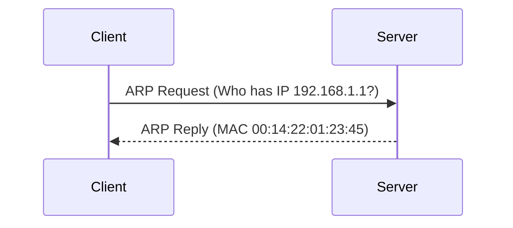

## **Address Resolution Protocol (ARP)**

#### **Overview of ARP**

**Definition**:  
The Address Resolution Protocol (ARP) is a network protocol used to map an IP address to a physical machine address (MAC address) that is recognized in the local network. ARP operates at the Data Link layer of the OSI model.

#### **Key Features of ARP**

- **IP to MAC Address Mapping**: ARP is primarily used to resolve the MAC address for a given IP address. When a device needs to send data to another device on the same local network, it needs to know the recipient's MAC address, which is not always directly available.
  
- **Broadcast**: ARP requests are sent as broadcast messages to all devices on the local network, asking "Who has this IP address?" Only the device with the matching IP address responds with its MAC address.

- **Cache**: To minimize network traffic, devices maintain an ARP cache where IP-to-MAC mappings are stored for a certain period.

#### **How ARP Works**

1. **ARP Request**: When a device wants to communicate with another device on the same network but doesn't know its MAC address, it sends an ARP request as a broadcast. The request contains the target IP address.
   
2. **ARP Reply**: The device that owns the target IP address sends an ARP reply, which includes its MAC address. This reply is sent directly to the requesting device (not as a broadcast).

3. **Caching**: The requesting device stores the MAC address in its ARP cache for future use, reducing the need for subsequent ARP requests.

4. **Timeout**: ARP entries in the cache are timed out after a certain period (usually a few minutes), after which a new ARP request is needed if the entry is still required.

#### **ARP Packet Structure**

An ARP packet consists of the following fields:

- **Hardware Type**: Specifies the type of hardware used, such as Ethernet (1).
- **Protocol Type**: Specifies the protocol being used, such as IPv4 (0x0800).
- **Hardware Address Length**: Length of the MAC address (6 bytes).
- **Protocol Address Length**: Length of the IP address (4 bytes).
- **Operation**: Specifies whether the packet is a request (1) or a reply (2).
- **Sender MAC Address**: MAC address of the sender.
- **Sender IP Address**: IP address of the sender.
- **Target MAC Address**: MAC address of the target (set to 0 in request).
- **Target IP Address**: IP address of the target.

#### **Types of ARP**

1. **ARP Request**: A device sends an ARP request to ask for the MAC address associated with a specific IP address.
2. **ARP Reply**: The device that owns the requested IP address replies with its MAC address.

#### **ARP Example**

- **ARP Request**: A device with IP `192.168.1.2` sends a broadcast request to ask for the MAC address of the device with IP `192.168.1.1`.
- **ARP Reply**: The device with IP `192.168.1.1` replies with its MAC address, say `00:14:22:01:23:45`.

#### **ARP Use Cases**

- **Local Network Communication**: ARP is crucial for devices communicating over a local network. Without ARP, devices wouldn’t know how to map IP addresses to MAC addresses, preventing them from properly communicating.
  
- **Device Identification**: ARP helps identify devices on a network by associating IP addresses with MAC addresses, which is essential for routing packets to the correct physical devices.

#### **ARP Cache**

Devices maintain an **ARP cache** that stores IP-to-MAC address mappings. This cache helps avoid the need for frequent ARP requests, which would otherwise introduce unnecessary delays and network traffic.

- **Stale Entries**: Over time, the ARP cache can contain outdated information, which can be cleared to ensure accurate mappings.
- **Manual Update**: In some cases, ARP entries can be manually updated or cleared by network administrators.

#### **Diagram of ARP Communication**

#### **Advantages of ARP**

- **Essential for Local Communication**: ARP is essential for enabling devices on a local network to communicate by resolving IP addresses to MAC addresses.
- **Reduces Network Load**: ARP cache minimizes network traffic by storing IP-to-MAC mappings for reuse.

#### **Limitations of ARP**

- **Security Risks**: ARP is vulnerable to **ARP spoofing** or **ARP poisoning**, where an attacker sends fake ARP replies to associate their MAC address with another device’s IP address. This can lead to man-in-the-middle attacks or denial-of-service.
  
- **Local Network Only**: ARP only operates within a local network. When data is sent across multiple networks (through routers), ARP cannot be used to resolve the destination MAC address.

#### **Conclusion**

ARP plays a vital role in local area networking by enabling devices to discover each other's MAC addresses based on IP addresses. However, it operates only within a local network and is subject to security risks like ARP spoofing. Despite its limitations, ARP is indispensable for basic network operations, and understanding its workings is crucial for network administration and security.

