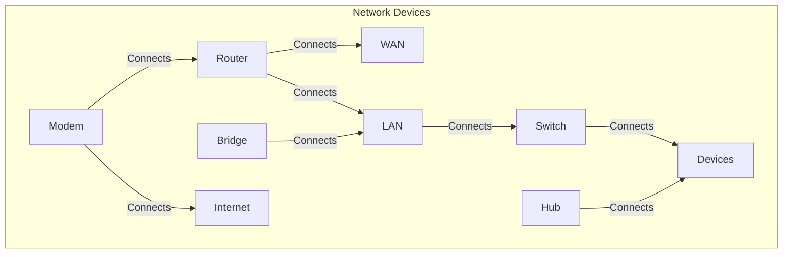

## Network Basics

### **Network Fundamentals**

#### **Definition of Networking**
Networking refers to the practice of connecting multiple devices such as computers, servers, printers, and other hardware over a communication medium to facilitate data exchange. Networks enable sharing of resources, data, and information across local, regional, or global scales.

#### **Importance of Networks in Modern Technology**
Networks play a crucial role in modern society, allowing businesses, individuals, and governments to access, share, and communicate information. They support a range of activities from email communication, web browsing, and data storage to cloud computing, video conferencing, and online gaming.

#### **Components of a Network**
A network consists of the following components:
- **Devices**: These are the physical hardware that connects to a network, such as computers, routers, switches, and printers.
- **Transmission Medium**: This is the physical medium used to transmit data, such as cables (fiber optic, copper) or wireless technologies (Wi-Fi, Bluetooth).
- **Protocols**: These are sets of rules and conventions for communication. Examples include TCP/IP, HTTP, and FTP.

---

### **Types of Networks**

#### **1. Local Area Network (LAN)**
A LAN is a network confined to a small geographical area, such as a single building or office. It is designed to connect computers and devices to share resources like files, printers, and internet access.

- **Key Features**:
  - High data transfer rates
  - Typically wired (Ethernet cables)
  - Low latency and high reliability

#### **2. Wide Area Network (WAN)**
A WAN spans a large geographical area, often connecting multiple LANs across cities, countries, or even continents. The internet itself is the largest WAN.

- **Key Features**:
  - Slower data transfer rates compared to LAN
  - Requires public or private communication links (satellite, fiber optic)
  - Used for connecting multiple business locations

#### **3. Metropolitan Area Network (MAN)**
A MAN covers a larger geographical area than a LAN but smaller than a WAN. It typically connects several LANs within a specific city or large campus.

- **Key Features**:
  - Typically used by large organizations or universities
  - Operates at high speeds, often using fiber optic cables

#### **4. Personal Area Network (PAN)**
A PAN is a small network typically used for connecting personal devices like smartphones, laptops, tablets, and wearables.

- **Key Features**:
  - Operates over short distances (typically up to 10 meters)
  - Common technologies: Bluetooth, infrared (IR)

#### **Comparison of Network Types**

| Feature         | LAN                      | WAN                    | MAN                   | PAN                      |
|-----------------|--------------------------|------------------------|-----------------------|--------------------------|
| **Coverage Area**| Small (Building/Office)   | Large (Country/Global) | Medium (City/Region)  | Very Small (Personal)    |
| **Data Transfer Speed** | High (Gbps)        | Low to Medium          | Medium                | Low (Bluetooth/IR)       |
| **Latency**      | Low                      | High                   | Medium                | Very Low                 |
| **Cost**         | Low                      | High                   | Medium                | Very Low                 |
| **Common Use** | Local communication | Interconnecting offices globally | University networks, Government agencies | Connecting personal devices |
| **Example Technologies** | Ethernet, Wi-Fi | Fiber Optics, Leased Lines | Fiber Optics, Microwave Links | Bluetooth, Wi-Fi |

#### **Diagram**
```mermaid
graph TD;
    A[LAN] -->|Coverage Area: Small (Home/Office)| B[Speed: High];
    B -->|Common Use: Local communication| C[Example Technologies: Ethernet, Wi-Fi];
    
    D[WAN] -->|Coverage Area: Large (Global)| E[Speed: Low to Medium];
    E -->|Common Use: Interconnecting offices globally| F[Example Technologies: Fiber Optics, Leased Lines];
    
    G[MAN] -->|Coverage Area: Medium (City)| H[Speed: Medium to High];
    H -->|Common Use: University networks, Government agencies| I[Example Technologies: Fiber Optics, Microwave Links];
    
    J[PAN] -->|Coverage Area: Very Small (Personal devices)| K[Speed: Very High (short range)];
    K -->|Common Use: Connecting personal devices| L[Example Technologies: Bluetooth, Wi-Fi];
```
---

### **Network Devices**

#### **1. Router**
A router connects different networks, typically a local network (LAN) to a wide area network (WAN) like the internet. It directs traffic between devices within a network and between different networks.

- **Functionality**: Routes data packets based on IP addresses, provides NAT (Network Address Translation), and assigns IP addresses.

#### **2. Switch**
A switch operates at the data link layer (Layer 2) of the OSI model and is used to connect devices within a local network. It is more efficient than a hub because it directs data only to the intended device.

- **Functionality**: Learns the MAC addresses of devices and forwards data only to the appropriate recipient.

#### **3. Hub**
A hub is a basic networking device used to connect multiple devices within a LAN. It operates at the physical layer (Layer 1) and broadcasts data to all connected devices.

- **Functionality**: Sends data to all devices, regardless of the intended recipient, leading to inefficiency and collisions.

#### **4. Bridge**
A bridge is used to connect two network segments, typically LANs, to work as a single network. It operates at the data link layer (Layer 2).

- **Functionality**: Filters traffic and reduces network congestion by forwarding only relevant data between segments.

#### **5. Modem**
A modem is a device that converts digital data from a computer into analog signals for transmission over telephone lines or vice versa.

- **Functionality**: Modulates and demodulates signals to allow internet connectivity over telephone lines, cable, or fiber optics.

#### **Comparison between Devices**
| Device    | Layer of OSI Model | Functionality                                                                 | Use Case                                      |
|-----------|--------------------|-------------------------------------------------------------------------------|-----------------------------------------------|
| **Router**| Network (Layer 3)  | Routes data packets based on IP addresses, provides NAT, assigns IP addresses | Connects different networks (e.g., LAN to WAN)|
| **Switch**| Data Link (Layer 2)| Learns MAC addresses, forwards data to the appropriate recipient              | Connects devices within a local network       |
| **Hub**   | Physical (Layer 1) | Sends data to all devices, regardless of the intended recipient               | Basic device to connect multiple devices in a LAN |
| **Bridge**| Data Link (Layer 2)| Filters traffic, reduces network congestion by forwarding relevant data       | Connects two network segments to work as a single network |
| **Modem** | Physical (Layer 1) | Modulates and demodulates signals for internet connectivity                   | Converts digital data to analog signals and vice versa for transmission over telephone lines, cable, or fiber optics |

#### **Diagram**

---

### **Network Models**

#### **1. OSI Model (Open Systems Interconnection)**
The OSI model is a conceptual framework used to understand network interactions in seven layers. Each layer is responsible for specific functions, and data passes through each layer when being transmitted or received.

- **7 Layers**:
  1. **Physical Layer**: Deals with hardware transmission (wires, radio waves).
  2. **Data Link Layer**: Responsible for node-to-node data transfer (Ethernet, MAC).
  3. **Network Layer**: Handles routing and forwarding of data (IP).
  4. **Transport Layer**: Ensures reliable data transfer (TCP, UDP).
  5. **Session Layer**: Manages sessions between applications (RPC).
  6. **Presentation Layer**: Translates data formats (encryption, compression).
  7. **Application Layer**: Provides end-user services (HTTP, FTP, DNS).

#### **2. TCP/IP Model (Transmission Control Protocol/Internet Protocol)**
The TCP/IP model is a more simplified 4-layer framework used for networking protocols. It is the foundation of the internet.

- **4 Layers**:
  1. **Link Layer**: Corresponds to the OSI physical and data link layers (Ethernet).
  2. **Internet Layer**: Handles routing and addressing (IP).
  3. **Transport Layer**: Ensures reliable data transmission (TCP, UDP).
  4. **Application Layer**: Provides end-user communication protocols (HTTP, SMTP).

#### **Comparison of OSI and TCP/IP Models**

| Layer (OSI)          | Function                            | TCP/IP Equivalent     |
|----------------------|-------------------------------------|-----------------------|
| **Physical**          | Physical transmission of data       | Link Layer            |
| **Data Link**         | Node-to-node data transfer          | Link Layer            |
| **Network**           | Routing and forwarding (IP)         | Internet Layer        |
| **Transport**         | Reliable data transfer (TCP/UDP)    | Transport Layer       |
| **Session**           | Managing sessions between applications | Application Layer   |
| **Presentation**      | Data translation, encryption        | Application Layer     |
| **Application**       | End-user services (HTTP, FTP)       | Application Layer     |

---

### **Properties of Networks**

#### **1. Bandwidth**
Bandwidth is the maximum rate at which data can be transferred over a network, typically measured in bits per second (bps). Higher bandwidth allows for faster data transmission.

- **Example**: A network with 1 Gbps bandwidth can transmit 1 billion bits per second.

#### **2. Throughput**
Throughput refers to the actual amount of data transmitted successfully over a network in a given period, usually measured in Mbps or Gbps. Throughput is often lower than bandwidth due to network inefficiencies, congestion, and protocol overhead.

#### **3. Latency**
Latency is the time delay between sending and receiving data. It is typically measured in milliseconds (ms). Lower latency is crucial for applications requiring real-time communication, such as VoIP and online gaming.

- **Factors Affecting Latency**:
  - Distance between the source and destination
  - Network congestion
  - Routing and switching delays

---