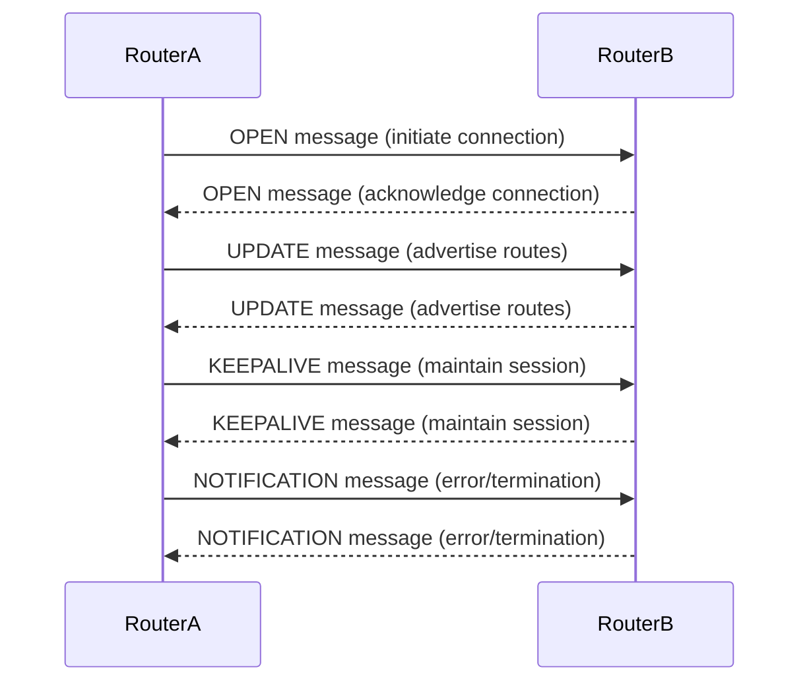

## **Border Gateway Protocol (BGP)**

#### **Overview of BGP**

**Definition**:  
Border Gateway Protocol (BGP) is the protocol used to exchange routing information between different autonomous systems (ASes) on the Internet. BGP is classified as a path vector protocol and is considered the backbone of the Internet, helping to determine the best routes for data transmission across complex networks.

#### **Key Features of BGP**

- **Path Vector Protocol**: BGP is a path vector protocol that uses a path list as the primary metric to determine the best routes between networks.
- **Inter-Domain Routing**: BGP operates between different Autonomous Systems (ASes), making it essential for Internet-scale routing.
- **Scalable**: BGP can scale to handle millions of IP prefixes and routing information in large networks.
- **Policy-Based Routing**: BGP allows network administrators to set routing policies based on various attributes like AS paths, prefixes, and other factors.

#### **Types of BGP**

1. **External BGP (eBGP)**:
   - **Used for**: Routing between different Autonomous Systems (ASes).
   - **Example**: Internet service providers (ISPs) use eBGP to exchange routing information.

2. **Internal BGP (iBGP)**:
   - **Used for**: Routing within the same Autonomous System.
   - **Example**: Used by large organizations to share routing information between routers within the same AS.

#### **BGP Message Types**

BGP messages are exchanged between BGP routers (peers) to establish and maintain routing tables. The main message types are:
1. **OPEN**: Initiates a BGP connection and exchanges parameters between peers.
2. **UPDATE**: Used to advertise new routes or withdraw previously advertised routes.
3. **NOTIFICATION**: Sent when there is an error or when a peer needs to terminate a session.
4. **KEEPALIVE**: Maintains the BGP connection by confirming that the peer is still reachable.

#### **BGP Route Attributes**

BGP routes are associated with several attributes that help determine the best path:
1. **AS Path**: A list of ASes that a route has passed through. The shorter the AS path, the more preferred the route.
2. **Next Hop**: The next hop IP address to reach the destination.
3. **Local Preference**: Indicates the preference of a route within an AS.
4. **Multi-Exit Discriminator (MED)**: Suggests the preferred exit point from the AS to reach a destination.
5. **Community**: Tags that provide additional routing policies based on a group of networks.

#### **BGP Path Selection Process**

BGP selects the best path based on the following order of criteria:
1. **Highest Local Preference**: The route with the highest local preference is chosen.
2. **Shortest AS Path**: The route with the fewest AS hops is preferred.
3. **Lowest Origin Type**: Routes from an IGP are preferred over routes from EGPs or unknown origins.
4. **Lowest MED**: A lower MED value is preferred if the same destination is reachable via multiple exits.
5. **eBGP over iBGP**: Routes learned via eBGP are preferred over those learned via iBGP.
6. **Lowest IGP Metric**: If all other attributes are equal, BGP will choose the route with the lowest IGP metric.

#### **How BGP Works**

1. **Neighbor Establishment**:
   - BGP routers establish a TCP connection (port 179) to communicate and exchange routing information. 
   - The **OPEN message** initiates the BGP session and exchanges parameters (e.g., AS numbers, BGP version).

2. **Route Advertisement**:
   - Once a connection is established, BGP routers exchange **UPDATE messages**, advertising new routes or withdrawing old ones.
   - The **UPDATE message** includes information about the destination IP, AS path, next-hop router, and other attributes.

3. **Route Selection**:
   - Each router maintains a routing table and uses BGP’s path selection process to determine the best route.
   - BGP routers use the AS Path, Local Preference, and other attributes to choose the optimal route.

4. **Maintaining the Session**:
   - BGP uses **KEEPALIVE messages** to maintain the session and ensure that the neighbor is reachable.
   - If an error occurs, a **NOTIFICATION message** is sent to terminate the session.

#### **BGP Example**

- **Scenario**: Two ISPs (AS 65001 and AS 65002) connect via eBGP, and AS 65001 advertises a prefix `192.168.1.0/24` to AS 65002. AS 65002 then chooses the route based on BGP attributes such as AS Path, Local Preference, and MED.

#### **BGP Use Cases**

1. **Internet Routing**: BGP is the core protocol used for routing data across the Internet, ensuring that data can find the most efficient path between different networks.
2. **Load Balancing**: BGP can be used to balance traffic across multiple links by advertising multiple routes.
3. **Redundancy and Failover**: BGP allows for automatic rerouting of traffic in case of network failures, providing redundancy.
4. **Peering Agreements**: ISPs use BGP to exchange routing information with each other, enabling direct communication and traffic flow.

#### **Diagram of BGP Communication**

#### **Advantages of BGP**

- **Scalable**: BGP can handle a large number of routes, making it suitable for the global Internet.
- **Flexibility**: BGP supports complex routing policies that allow network administrators to control traffic flow.
- **Redundancy**: BGP provides mechanisms for automatic rerouting and failover in case of network failures.

#### **Limitations of BGP**

- **Complexity**: BGP configuration and maintenance can be complex, especially in large networks.
- **Convergence Time**: BGP can take time to converge when there is a network topology change, leading to potential delays.
- **Security Risks**: BGP is vulnerable to attacks such as **BGP route hijacking** or **BGP prefix hijacking**, where malicious actors manipulate routing tables.

#### **Conclusion**

BGP is a crucial protocol for the Internet's routing infrastructure, allowing efficient data routing between autonomous systems. While it offers flexibility and scalability, it also comes with challenges like complexity and potential security vulnerabilities. Understanding BGP’s mechanisms and use cases is fundamental for network engineers and administrators.

