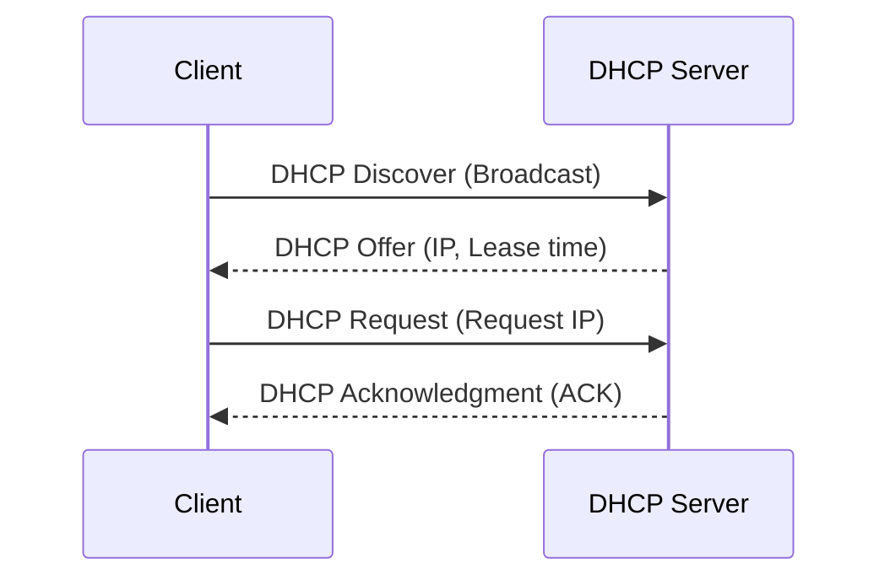

## **Dynamic Host Configuration Protocol (DHCP)**

#### **Overview of DHCP**

**Definition**:  
The Dynamic Host Configuration Protocol (DHCP) is a network management protocol that allows servers to automatically assign IP addresses to devices on a network. This protocol simplifies the management and configuration of devices within a network by dynamically allocating and managing IP addresses without the need for manual configuration.

#### **Key Features of DHCP**

- **Automatic IP Assignment**: Automatically assigns IP addresses to devices on a network, reducing administrative overhead.
- **Lease Time**: DHCP leases IP addresses for a specific time period, after which they may be reassigned.
- **Centralized Management**: All IP configurations are managed from a centralized DHCP server.
- **IP Address Pool**: The DHCP server has a range of IP addresses to allocate to clients.
- **Efficiency**: Reduces the need for static IP configuration, making it more scalable and flexible.

#### **How DHCP Works**

The DHCP process occurs in four stages:

1. **DHCP Discover**:  
   The client (a device) sends a broadcast message, **DHCP Discover**, looking for a DHCP server on the network.
2. **DHCP Offer**:  
   The DHCP server responds with a **DHCP Offer** message that includes an available IP address, lease time, and other network configurations (such as DNS server and default gateway).
3. **DHCP Request**:  
   The client receives the offer and responds with a **DHCP Request** message, confirming its acceptance of the offer.
4. **DHCP Acknowledgment (ACK)**:  
   The server sends a **DHCP ACK** message to the client, confirming that the IP address has been leased.

#### **DHCP Process Flow with Diagram**

This diagram represents the interaction between the client and server during the DHCP lease process.

#### **DHCP Message Types**

1. **DHCP Discover**:  
   Sent by the client to discover DHCP servers on the network.
2. **DHCP Offer**:  
   Sent by the server in response to a Discover message, offering an IP address to the client.
3. **DHCP Request**:  
   Sent by the client to accept an offered IP address and request lease details.
4. **DHCP Acknowledgment (ACK)**:  
   Sent by the server to confirm that the client can use the IP address.
5. **DHCP NACK (Negative Acknowledgment)**:  
   Sent by the server to indicate that the request cannot be processed, often because the requested address is no longer available.
6. **DHCP Release**:  
   Sent by the client to release the IP address and notify the server that the address is no longer in use.
7. **DHCP Inform**:  
   Sent by the client to request additional information (e.g., DNS settings) without changing its IP address.

#### **DHCP Configuration Options**

- **IP Address Pool**:  
  The DHCP server maintains a pool of available IP addresses. It dynamically allocates addresses from this pool to requesting clients.
  
- **Subnet Mask**:  
  Defines the size of the network and how the IP address is divided between the network and host portions.

- **Default Gateway**:  
  The device used to route traffic from the client to other networks (often a router).

- **DNS Servers**:  
  IP addresses of DNS servers to be used by clients for name resolution.

- **Lease Time**:  
  The duration for which an IP address is assigned to a client. After the lease expires, the client must request a renewal or release the IP address.

#### **DHCP vs Static IP Addressing**

| **Feature**              | **DHCP**                               | **Static IP**                           |
|--------------------------|----------------------------------------|-----------------------------------------|
| **IP Address Assignment** | Dynamic, automatic from a pool        | Fixed, manually configured              |
| **Configuration**         | Automatically configured               | Requires manual configuration          |
| **Flexibility**           | Highly flexible, IPs can be reused     | Not flexible, IPs are fixed             |
| **Maintenance**           | Low maintenance, managed by server     | High maintenance, IPs must be updated manually |
| **Best Use**              | Ideal for large networks with frequent device changes | Best for devices that require fixed IPs (e.g., servers) |

#### **Advantages of DHCP**

- **Automatic Configuration**: Devices automatically receive configuration details without user intervention.
- **Efficient IP Addressing**: Automatically manages IP address assignments, preventing address conflicts and simplifying network management.
- **Scalable**: Suitable for networks of any size, from small offices to large enterprises.
- **Reduced Errors**: Manual IP assignment often leads to errors; DHCP minimizes these mistakes by automating the process.

#### **Limitations of DHCP**

- **Security Risks**: Malicious DHCP servers (rogue servers) can assign incorrect IP configurations, leading to man-in-the-middle attacks or denial of service.
- **Server Dependency**: The entire network relies on the DHCP server to provide IP addresses. If the server fails, new devices cannot connect to the network.
- **IP Address Conflicts**: In networks where IP pools are exhausted or misconfigured, IP conflicts can occur.

#### **DHCP Security Considerations**

- **Rogue DHCP Servers**:  
  Unauthorized DHCP servers can be introduced into the network, causing clients to obtain incorrect IP configurations. This can lead to network disruptions or security vulnerabilities.
  
  **Mitigation**:  
  - **DHCP Snooping**: A security feature that allows switches to track DHCP messages, ensuring only trusted servers can assign IP addresses.
  - **IP/MAC Address Binding**: Ensures that a specific IP address is assigned to a specific MAC address.
  
- **DHCP Authentication**:  
  Devices can be configured to authenticate DHCP servers before accepting IP addresses, ensuring that only legitimate servers are used.

#### **DHCP and IP Address Management**

The DHCP server manages a pool of IP addresses, allocating them to clients for a specified lease time. When the lease expires, the IP address can either be renewed by the client or returned to the pool for reassignment.

- **DHCP Lease Renewal**:  
  Before a lease expires, the client attempts to renew it by sending a DHCP Request to the server. If the server acknowledges the request, the lease is renewed for another period.
  
- **IP Address Reuse**:  
  If a device disconnects or is powered off, its IP address can be reassigned to another device, improving the efficiency of IP address utilization.

#### **DHCP in Home Networks**

In home networks, DHCP is commonly used to simplify the connection of multiple devices such as smartphones, laptops, tablets, and smart devices (e.g., printers and TVs). The router often acts as the DHCP server, automatically assigning IP addresses to each device on the network.

- **Router as DHCP Server**:  
  Most home routers include a built-in DHCP server. When a device connects to the network, it automatically requests and receives an IP address from the router’s DHCP pool.

#### **Use Cases for DHCP**

1. **Home Networks**:  
   Simplifies the process of connecting new devices to the network by automatically assigning IP addresses.
   
2. **Business Networks**:  
   In large office environments, DHCP simplifies network administration by automating IP assignment, reducing the need for manual configuration and ensuring IP addresses are efficiently allocated.
   
3. **Internet Service Providers (ISPs)**:  
   ISPs use DHCP to dynamically assign IP addresses to customers' modems or routers, enabling users to connect to the internet without manually configuring IP addresses.
   
4. **Large-scale Deployments**:  
   For universities, data centers, or enterprise networks, DHCP helps manage thousands of devices by automatically assigning them IP addresses and network settings.

#### **Additional DHCP Terminology**

- **DHCP Relay**:  
  A device (usually a router) that forwards DHCP messages between clients and servers when they are not on the same local network.

- **DHCP Scope**:  
  The range of IP addresses available for assignment by the DHCP server.

