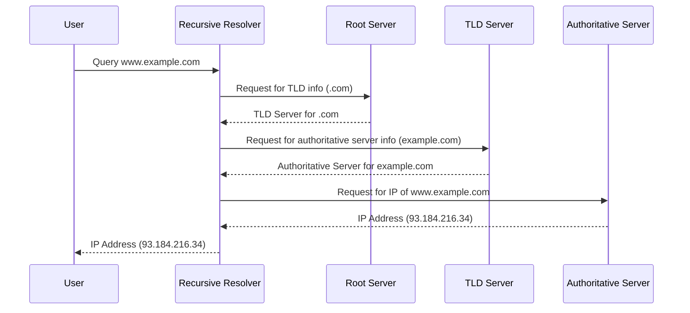

# **Domain Name System (DNS)**

## **Domain Name System (DNS)**

#### **Overview**
DNS (Domain Name System) is a hierarchical and distributed naming system used to resolve human-readable domain names (e.g., `www.example.com`) into machine-readable IP addresses (e.g., `192.168.1.1`) and vice versa. It is a fundamental protocol of the internet that ensures users can access websites and other internet resources efficiently.


#### **Key Features**
- **Hierarchical Structure**: DNS operates in a tree-like structure with domains and subdomains.
- **Distributed System**: The DNS database is distributed across multiple servers worldwide, preventing a single point of failure.
- **Caching**: DNS uses caching to reduce lookup times for frequently accessed domains.
- **Scalability**: DNS can handle a vast number of domain name queries due to its decentralized nature.


#### **DNS Components**
1. **Domain Names**: Human-readable names (e.g., `example.com`).
2. **IP Addresses**: Machine-readable addresses (e.g., `192.168.1.1` or `2001:0db8::ff00:0042:8329`).
3. **Name Servers**: Servers that store DNS records and respond to queries.
4. **Resolvers**: Client-side entities that query the DNS servers.


#### **DNS Hierarchy**
1. **Root Domain**: Represented by a dot (`.`), it is the starting point of the DNS hierarchy.
2. **Top-Level Domains (TLDs)**: Includes domains like `.com`, `.org`, `.edu`, `.gov`, and country codes like `.in` or `.uk`.
3. **Second-Level Domains**: Specific names under TLDs, such as `example` in `example.com`.
4. **Subdomains**: Domains created under second-level domains, such as `blog.example.com`.


#### **DNS Record Types**
- **A Record**: Maps a domain name to an IPv4 address.
- **AAAA Record**: Maps a domain name to an IPv6 address.
- **CNAME Record**: Points a domain name to another domain name.
- **MX Record**: Specifies mail servers for the domain.
- **TXT Record**: Stores arbitrary text, often used for verification and security purposes.
- **NS Record**: Indicates the authoritative name servers for the domain.
- **PTR Record**: Provides reverse DNS lookup (IP to domain name).
- **SOA Record**: Contains administrative information about the domain.


#### **DNS Resolution Process**
1. **User Request**: The user enters a domain name into a browser.
2. **Recursive Resolver**: The resolver queries the DNS hierarchy to find the IP address.
3. **Root Server**: The resolver queries the root server for the domain's TLD.
4. **TLD Server**: The resolver queries the TLD server for the authoritative name server.
5. **Authoritative Name Server**: The resolver retrieves the IP address from the authoritative server.
6. **Response**: The IP address is returned to the browser, and the website loads.


#### **Example DNS Query**
```plaintext
User enters: www.example.com

1. Query to Recursive Resolver: What is the IP for www.example.com?
2. Query to Root Server: What is the TLD for .com?
3. Query to TLD Server: Where is the authoritative server for example.com?
4. Query to Authoritative Server: What is the IP for www.example.com?
5. Response: IP address (e.g., 93.184.216.34) is returned.
```


#### **Diagram**



### **Comparison of Forward DNS and Reverse DNS**

| **Aspect**              | **Forward DNS**                                          | **Reverse DNS**                                          |
|-------------------------|----------------------------------------------------------|----------------------------------------------------------|
| **Purpose**             | Resolves domain names into IP addresses.                | Resolves IP addresses into domain names.                |
| **Record Type**         | Uses A and AAAA records.                                 | Uses PTR records.                                        |
| **Usage**               | Accessing websites and online resources.                | Used in email security and network diagnostics.          |
| **Example**             | `www.example.com` → `93.184.216.34`.                     | `93.184.216.34` → `www.example.com`.                     |


### **DNS Use Cases**
1. **Website Access**: Maps user-friendly domain names to IP addresses.
2. **Load Balancing**: Directs traffic to multiple servers for efficient resource use.
3. **Email Delivery**: Uses MX records to route emails to the correct servers.
4. **Network Diagnostics**: Reverse DNS lookups help trace IP addresses to domain names.
5. **Security**: TXT records are used for domain verification and email authentication (e.g., SPF, DKIM).


### **Limitations**
1. **Latency**: DNS resolution can introduce slight delays.
2. **Cache Poisoning**: Vulnerable to attacks that manipulate cached data.
3. **Scalability Challenges**: High traffic can overwhelm DNS servers without proper infrastructure.


## **Forward DNS and Reverse DNS**


#### **Forward DNS**

**Definition**:  
Forward DNS is the traditional DNS resolution process that translates a human-readable domain name (e.g., `www.example.com`) into a machine-readable IP address (e.g., `93.184.216.34`). It is essential for enabling access to websites and services on the internet.


##### **Key Features**
- **Primary Use**: Converts domain names into IP addresses to locate resources on the internet.
- **Record Types**:  
  - **A Record**: Maps domain names to IPv4 addresses.  
  - **AAAA Record**: Maps domain names to IPv6 addresses.
- **Cache Mechanism**: Results are often cached by recursive resolvers to speed up subsequent queries.
- **Commonality**: Most DNS queries on the internet involve forward DNS resolution.


##### **How It Works**
1. **Query Submission**: A user enters a domain name (e.g., `www.example.com`) in a browser.
2. **Resolver Role**: The resolver asks the DNS hierarchy (root, TLD, and authoritative servers) for the corresponding IP address.
3. **Response Delivery**: The resolver receives and returns the IP address (e.g., `93.184.216.34`) to the user’s system.
4. **Website Access**: The browser uses the IP address to connect to the target server.


##### **Use Cases**
1. **Web Browsing**: Resolves domain names for websites.
2. **API Access**: Converts service endpoints (e.g., `api.example.com`) into IP addresses.
3. **Email Routing**: Uses MX records alongside forward DNS for identifying mail servers.


##### **Example of Forward DNS Query**
```plaintext
User enters: www.example.com

1. Query: What is the IP address of www.example.com?
2. Recursive Resolver → Root Server: Request for .com TLD info.
3. Recursive Resolver → TLD Server: Request for example.com authoritative server.
4. Recursive Resolver → Authoritative Server: Request for A record of www.example.com.
5. Response: 93.184.216.34 (IP address) is returned to the user.
```

##### **Advantages**
- **User-Friendly**: Allows users to use domain names instead of numerical IP addresses.
- **Scalability**: Supports a hierarchical structure, making it efficient for large-scale use.

##### **Limitations**
- **Vulnerable to Cache Poisoning**: Can be exploited by attackers to redirect users to malicious IP addresses.
- **Latency**: The resolution process can add slight delays, especially for uncached queries.


#### **Reverse DNS**

**Definition**:  
Reverse DNS (rDNS) resolves IP addresses back into human-readable domain names. This process is essentially the opposite of forward DNS and is used primarily for verification and diagnostics.


##### **Key Features**
- **Primary Use**: Converts IP addresses into domain names for identification and verification.
- **Record Types**:  
  - **PTR (Pointer Record)**: Maps an IP address to its corresponding domain name.
- **Required Setup**: Reverse DNS requires specific configuration from the IP address owner, often the ISP.
- **DNS Delegation**: Managed by the organization controlling the IP address range.


##### **How It Works**
1. **Query Submission**: A system queries the DNS server with an IP address (e.g., `93.184.216.34`).
2. **Reverse Lookup**: The resolver uses the `in-addr.arpa` domain for IPv4 or `ip6.arpa` for IPv6 to locate the PTR record.
3. **Response Delivery**: The resolver returns the domain name associated with the IP (e.g., `www.example.com`).


##### **Use Cases**
1. **Email Security**: Verifies that the sending mail server’s IP address matches its domain (e.g., for SPF, DKIM, DMARC checks).
2. **Network Diagnostics**: Identifies servers or devices by their domain names during troubleshooting.
3. **Access Control**: Ensures only authorized domains are linked to specific IPs in some restricted networks.


##### **Example of Reverse DNS Query**
```plaintext
System queries: What is the domain name for IP address 93.184.216.34?

1. Query: Reverse lookup for 34.216.184.93.in-addr.arpa.
2. Recursive Resolver → Root Server: Request for ARPA domain info.
3. Recursive Resolver → ISP Name Server: Request for PTR record for 34.216.184.93.
4. Response: PTR record returns www.example.com.
```

##### **Advantages**
- **Verification**: Helps confirm the legitimacy of servers and IP addresses.
- **Diagnostics**: Useful for network and server troubleshooting.
- **Email Authentication**: Plays a critical role in preventing email spoofing and spam.

##### **Limitations**
- **Dependency on ISPs**: Requires configuration by the IP owner, typically the ISP.
- **Lack of Universality**: Not all IPs have reverse DNS entries configured.
- **Slower Resolution**: Reverse lookups can be slower compared to forward lookups due to the additional hierarchy in `in-addr.arpa` or `ip6.arpa`.


### **Comparison of Forward DNS and Reverse DNS**

| **Aspect**              | **Forward DNS**                                          | **Reverse DNS**                                          |
|-------------------------|----------------------------------------------------------|----------------------------------------------------------|
| **Purpose**             | Converts domain names into IP addresses.                 | Converts IP addresses into domain names.                 |
| **Record Type**         | Uses A (IPv4) and AAAA (IPv6) records.                   | Uses PTR records.                                        |
| **Domain Space**        | Operates directly on user-defined domains.               | Operates in `in-addr.arpa` (IPv4) or `ip6.arpa` (IPv6).   |
| **Setup**               | Automatically configured for registered domains.         | Requires manual configuration by the IP owner or ISP.    |
| **Use Cases**           | Website access, API calls, and email routing.            | Email authentication, diagnostics, and access control.   |
| **Example**             | `www.example.com` → `93.184.216.34`.                     | `93.184.216.34` → `www.example.com`.                     |
