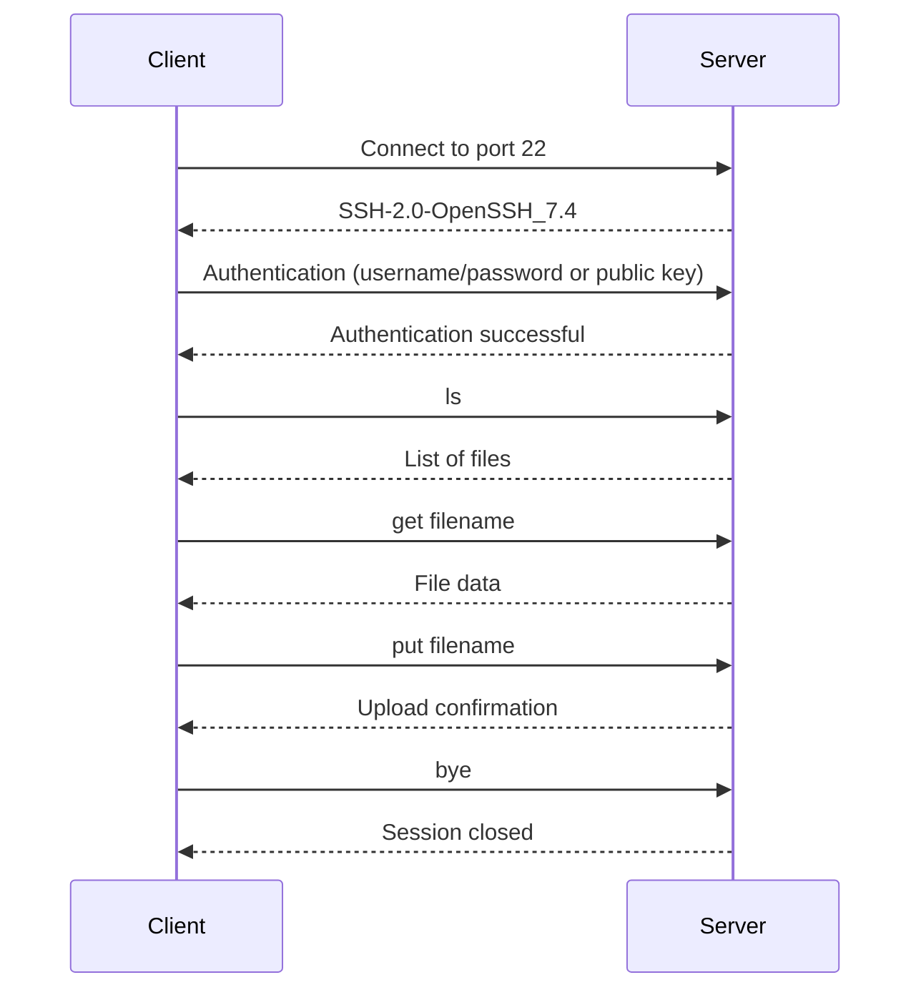

# FTP/SFTP (File Transfer Protocol / Secure File Transfer Protocol)

## File Transfer Protocol (FTP)

### Overview

FTP (File Transfer Protocol) is a standard network protocol used to transfer files between a client and a server over a TCP/IP-based network, such as the Internet. FTP is built on a client-server model architecture and uses separate control and data connections between the client and the server.

### Key Features

- **Two Modes of Operation**: FTP operates in two modes: Active and Passive.
- **Authentication**: FTP supports user authentication with a username and password.
- **Data Types**: FTP can transfer ASCII and binary files.
- **Directory Operations**: FTP allows users to navigate the server's file system, list directories, and manage files.

### How FTP Works

1. **Control Connection**: 
   - Established on TCP port 21.
   - Used for sending commands and receiving responses.
   - Persistent throughout the session.

2. **Data Connection**:
   - Established on TCP port 20 (active mode) or a random port (passive mode).
   - Used for transferring actual file data.
   - Created and closed for each file transfer or directory listing.

### FTP Commands

- **USER**: Specifies the username for authentication.
- **PASS**: Specifies the password for authentication.
- **LIST**: Lists files in the current directory.
- **RETR**: Retrieves (downloads) a file from the server.
- **STOR**: Stores (uploads) a file to the server.
- **CWD**: Changes the working directory.
- **QUIT**: Ends the FTP session.

### FTP Modes

- **Active Mode**:
  - The client opens a random port and waits for the server to connect to it.
  - The server initiates the data connection to the client's specified port.

- **Passive Mode**:
  - The server opens a random port and waits for the client to connect to it.
  - The client initiates the data connection to the server's specified port.
  - Used to solve issues with firewalls and NAT.

### Security Considerations

- **Plain Text Transmission**: FTP transmits data, including credentials, in plain text, making it vulnerable to interception.
- **Secure Alternatives**: Use FTPS (FTP Secure) or SFTP (SSH File Transfer Protocol) for encrypted file transfers.

### Common Use Cases

- **Website Management**: Uploading and downloading website files.
- **File Sharing**: Sharing large files between users.
- **Backup**: Transferring backup files to a remote server.

### Example FTP Session

```plaintext
ftp> open ftp.example.com
Connected to ftp.example.com.
220 Welcome to FTP server.
Name (ftp.example.com:user): user
331 Password required for user.
Password:
230 User logged in.
ftp> ls
200 PORT command successful.
150 Opening ASCII mode data connection for file list.
drwxr-xr-x   2 user  group  4096 Jan 01 12:00 directory
-rw-r--r--   1 user  group  1234 Jan 01 12:00 file.txt
226 Transfer complete.
ftp> get file.txt
200 PORT command successful.
150 Opening BINARY mode data connection for file.txt (1234 bytes).
226 Transfer complete.
ftp> bye
221 Goodbye.
```

### FTP Sequence Diagram

```mermaid
sequenceDiagram;
    participant Client;
    participant Server;

    Client->>Server: Connect to port 21;
    Server-->>Client: 220 Service ready;
    
    Client->>Server: USER username;
    Server--

>>

Client: 331 User name okay, need password;
    
    Client->>Server: PASS password;
    Server-->>Client: 230 User logged in;
    
    Client->>Server: LIST;
    Server-->>Client: 150 Opening data connection;
    Server-->>Client: 226 Transfer complete;
    
    Client->>Server: RETR filename;
    Server-->>Client: 150 Opening data connection;
    Server-->>Client: 226 Transfer complete;
    
    Client->>Server: QUIT;
    Server-->>Client: 221 Service closing control connection;
```

### Conclusion

FTP is a fundamental protocol for file transfer operations, widely used despite its security limitations. For secure file transfers, consider using FTPS or SFTP.


## Secure File Transfer Protocol (SFTP)

### Overview

SFTP (Secure File Transfer Protocol) is a network protocol that provides secure file access, transfer, and management functionalities over a reliable data stream. It operates over the SSH (Secure Shell) protocol, ensuring secure communication.

### Key Features

- **Encryption**: SFTP encrypts both commands and data, preventing passwords and sensitive information from being transmitted in plain text.
- **Authentication**: Supports various authentication methods, including password-based and public key-based authentication.
- **Data Integrity**: Ensures data integrity by using cryptographic hash functions.
- **Directory Operations**: Allows users to navigate the server's file system, list directories, and manage files securely.

### How SFTP Works

1. **Connection Establishment**:
   - SFTP operates over an SSH connection, typically established on TCP port 22.
   - The client initiates the connection to the server.

2. **Authentication**:
   - The client authenticates using a username and password or public key.
   - Once authenticated, the client can perform file operations.

3. **File Operations**:
   - SFTP supports various file operations such as uploading, downloading, renaming, and deleting files.
   - All operations are encrypted and secure.

### SFTP Commands

- **ls**: Lists files in the current directory.
- **get**: Downloads a file from the server.
- **put**: Uploads a file to the server.
- **cd**: Changes the working directory.
- **rm**: Removes a file.
- **mkdir**: Creates a directory.
- **rmdir**: Removes a directory.
- **exit**: Ends the SFTP session.

### Security Considerations

- **Encryption**: SFTP encrypts all data, including credentials, ensuring secure transmission.
- **Authentication**: Supports strong authentication methods, including public key authentication.

### Common Use Cases

- **Secure File Transfer**: Transferring sensitive files securely over an encrypted connection.
- **Remote File Management**: Managing files on a remote server securely.
- **Automated Backups**: Automating secure backups to a remote server.

### Example SFTP Session

```plaintext
sftp> open sftp.example.com
Connecting to sftp.example.com...
sftp> login: user
Password:
sftp> ls
directory
file.txt
sftp> get file.txt
Fetching /home/user/file.txt to file.txt
sftp> put localfile.txt
Uploading localfile.txt to /home/user/localfile.txt
sftp> bye
```

### SFTP Sequence Diagram



### Conclusion

SFTP is a secure and reliable protocol for file transfer operations, providing encryption and strong authentication methods. It is widely used for secure file transfers and remote file management.


## Comparison


| Feature/Protocol          | FTP (File Transfer Protocol)      | SFTP (Secure File Transfer Protocol) |
|---------------------------|-----------------------------------|--------------------------------------|
| **Port**                  | 21                                | 22                                   |
| **Encryption**            | No                                | Yes (SSH)                            |
| **Authentication**        | Username, Password                | Password, Public Key                 |
| **Data Integrity**        | No                                | Yes                                  |
| **Command Encryption**    | No                                | Yes                                  |
| **File Transfer Modes**   | ASCII, Binary                     | Binary                               |
| **Directory Operations**  | Yes                               | Yes                                  |
| **Firewall Compatibility**| Poor                              | Good                                 |
| **Ease of Setup**         | Easy                              | Moderate                             |
| **Performance**           | High                              | Moderate                             |
| **Use Cases**             | General file transfer             | Secure file transfer, remote file management |
| **Protocol Complexity**   | Simple                            | Moderate                             |
| **Session Management**    | Yes                               | Yes                                  |
| **Transfer Resume**       | Yes                               | Yes                                  |

