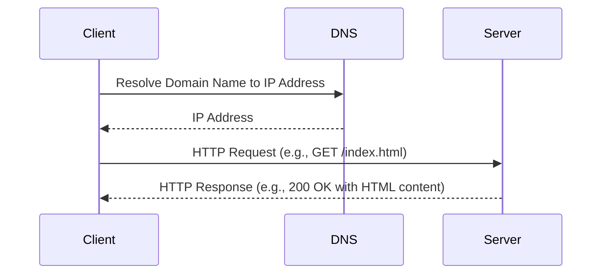
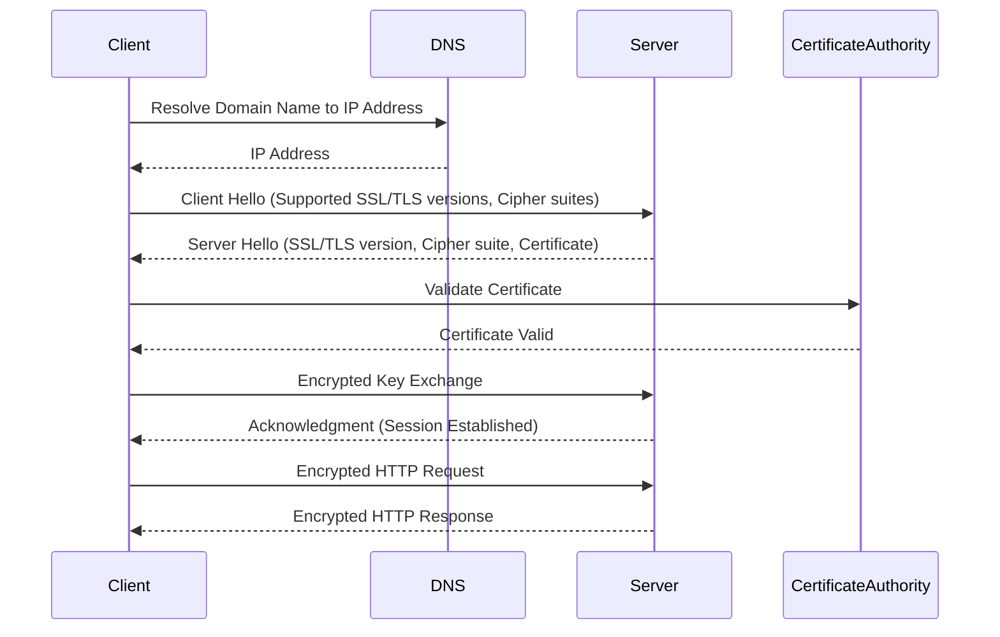

# **HyperText Transfer Protocol (HTTP) and HyperText Transfer Protocol Secure (HTTPS)**

HTTP (HyperText Transfer Protocol) and HTTPS (HyperText Transfer Protocol Secure) are widely used protocols for communication on the web. HTTP is the foundational protocol for transferring data, while HTTPS is the secure version, ensuring data integrity, encryption, and authentication.


## **HTTP (HyperText Transfer Protocol)**

#### **Key Features**
- **Stateless Protocol**: Each request-response pair is independent; no session information is retained between requests.
- **Text-Based Protocol**: HTTP messages are human-readable and consist of requests and responses.
- **Client-Server Model**: Clients initiate requests, and servers process and send responses.
- **Unsecured**: Data is transmitted in plain text, making it vulnerable to interception.

#### **HTTP Methods**
- **GET**: Retrieves data from a resource.
- **POST**: Submits data to a resource for processing.
- **PUT**: Updates an existing resource or creates a new one.
- **DELETE**: Deletes a resource.
- **HEAD**: Fetches headers without the body.
- **OPTIONS**: Returns the communication options for a resource.
- **PATCH**: Applies partial modifications to a resource.

#### **HTTP Status Codes**
- **1xx (Informational)**: Indicates that the request is being processed.
- **2xx (Success)**:
  - **200 OK**: Request succeeded.
  - **201 Created**: Resource was successfully created.
- **3xx (Redirection)**:
  - **301 Moved Permanently**: Resource has a new permanent URL.
  - **302 Found**: Resource temporarily resides under a different URL.
- **4xx (Client Errors)**:
  - **400 Bad Request**: Syntax error in the request.
  - **401 Unauthorized**: Requires authentication.
  - **404 Not Found**: Requested resource not found.
- **5xx (Server Errors)**:
  - **500 Internal Server Error**: General server issue.
  - **503 Service Unavailable**: Server is not ready to handle the request.

#### **Example HTTP Request and Response**
```plaintext
Request:
GET /index.html HTTP/1.1
Host: www.example.com
User-Agent: Mozilla/5.0

Response:
HTTP/1.1 200 OK
Content-Type: text/html
Content-Length: 138

<html>
<head>
<title>Example</title>
</head>
<body>
<h1>Hello, World!</h1>
</body>
</html>
```

#### **Diagram**



## **HTTPS (HyperText Transfer Protocol Secure)**

#### **Key Features**
- **Encryption**: Data is encrypted using SSL/TLS, ensuring privacy.
- **Authentication**: Confirms the server's identity through certificates issued by trusted Certificate Authorities (CAs).
- **Data Integrity**: Protects data from being tampered with during transfer.

#### **How HTTPS Works**
1. **Client Hello**: Client requests a secure connection by sending supported SSL/TLS versions and cipher suites.
2. **Server Hello**: Server responds with its SSL/TLS version, cipher suite, and digital certificate.
3. **Certificate Verification**: Client verifies the server's certificate with a CA.
4. **Key Exchange**: Both parties establish a secure session key.
5. **Secure Communication**: Encrypted data is transmitted between the client and server.

#### **Differences Between HTTP and HTTPS**
| **Feature**         | **HTTP**                  | **HTTPS**                  |
|----------------------|---------------------------|----------------------------|
| **Security**         | No encryption            | Data is encrypted          |
| **Port**             | 80                       | 443                        |
| **Certificate**      | Not required             | Requires an SSL/TLS cert   |
| **Performance**      | Faster due to no encryption | Slightly slower due to encryption |

#### **Example HTTPS Request and Response**
```plaintext
Request:
GET /index.html HTTP/1.1
Host: www.example.com
User-Agent: Mozilla/5.0

Response:
HTTP/1.1 200 OK
Content-Type: text/html
Content-Length: 138

<html>
<head>
<title>Example</title>
</head>
<body>
<h1>Hello, World!</h1>
</body>
</html>
```

#### **Diagram**



### **Use Cases**
- **HTTP**: Public information, non-sensitive data.
- **HTTPS**: Online transactions, login pages, sensitive user data.

## **Comparison of HTTP and HTTPS**

| **Aspect**                | **HTTP**                                                        | **HTTPS**                                                         |
|---------------------------|-----------------------------------------------------------------|-------------------------------------------------------------------|
| **Full Form**             | HyperText Transfer Protocol                                    | HyperText Transfer Protocol Secure                               |
| **Purpose**               | Transfers data over the web without encryption.               | Transfers data over the web securely with encryption.           |
| **Security**              | - No encryption<br>- Vulnerable to eavesdropping and attacks. | - Provides encryption using SSL/TLS.<br>- Ensures data privacy, authentication, and integrity. |
| **Port Number**           | Default port is **80**.                                        | Default port is **443**.                                         |
| **Encryption**            | No encryption; data is in plain text.                         | Data is encrypted, making it secure from interception.           |
| **Authentication**        | No server authentication.                                     | Server authentication is ensured using SSL/TLS certificates.     |
| **Data Integrity**        | No protection; data can be altered in transit.                | Ensures data is not modified during transmission.                |
| **Certificate Requirement** | Does not require certificates.                                | Requires an SSL/TLS certificate issued by a Certificate Authority (CA). |
| **Speed**                 | Faster due to no encryption overhead.                        | Slightly slower due to encryption and decryption processes.       |
| **Cost**                  | Free; no certificate costs.                                   | May incur costs for obtaining SSL/TLS certificates.              |
| **Use Cases**             | - Non-sensitive websites<br>- Public resources.              | - Online banking<br>- E-commerce<br>- Login pages<br>- APIs requiring secure data. |


### **Key Differences**
1. **Encryption**: HTTP transmits data in plain text, whereas HTTPS encrypts data to protect against unauthorized access.
2. **Security**: HTTPS includes authentication mechanisms, ensuring that communication is with the intended server.
3. **Ports**: HTTP uses port 80, while HTTPS uses port 443.
4. **Performance**: HTTP is faster as it does not perform encryption, whereas HTTPS involves encryption overhead.
5. **Trust**: HTTPS is mandatory for sensitive transactions, as it inspires trust and ensures compliance with data protection regulations.

