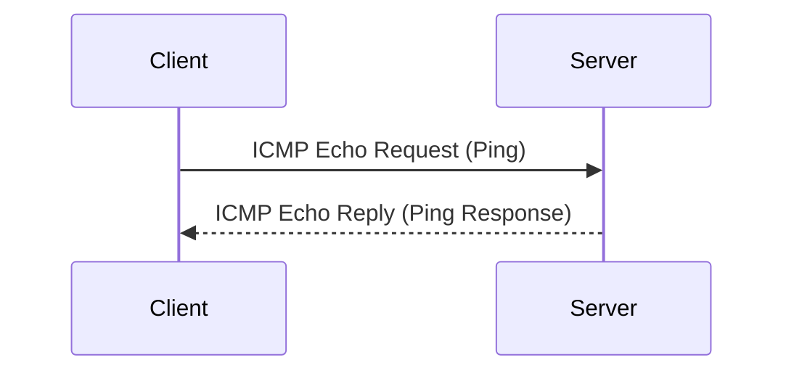

## **Internet Control Message Protocol (ICMP)**

#### **Overview of ICMP**

**Definition**:  
The Internet Control Message Protocol (ICMP) is a network layer protocol used primarily for sending error messages and operational information about the network. It is integral to the proper functioning of the Internet, providing diagnostics and reporting for network-related issues.

#### **Key Features of ICMP**

- **Error Reporting**: ICMP is primarily used by network devices like routers and hosts to send error messages indicating issues with packet transmission.
- **Diagnostics**: It is widely used in diagnostic tools such as `ping` and `traceroute` to determine network connectivity and to trace the route packets take to reach a destination.
- **Connectionless**: ICMP does not establish a connection between sender and receiver. It is used to send notifications about errors or the status of a network but does not require confirmation from the recipient.
- **Part of IP**: ICMP is considered part of the Internet Protocol (IP), specifically operating within the network layer.

#### **ICMP Message Types**

ICMP messages are categorized into two main types:
1. **Error Messages**: Notify the sender of network problems.
   - **Destination Unreachable**: The destination is unreachable for various reasons (network, host, or protocol unreachable).
   - **Time Exceeded**: The packet's Time-to-Live (TTL) expired before it reached its destination.
   - **Redirect**: Tells the sender to use a different route.

2. **Informational Messages**: Provide information about the status of the network.
   - **Echo Request (Ping)**: A request for a reply, used by the `ping` command.
   - **Echo Reply (Ping Response)**: The reply to the Echo Request, confirming the receiver is reachable.
   - **Timestamp Request/Reply**: Used for network time synchronization.

#### **ICMP Header Structure**

An ICMP message consists of:
- **Type**: Specifies the type of message being sent (e.g., Echo Request, Destination Unreachable).
- **Code**: Provides additional information about the message type (e.g., code 0 for "no route to destination" in Destination Unreachable).
- **Checksum**: Used to check for errors in the message.
- **Rest of the Header**: Contains different fields depending on the message type (e.g., identifiers, sequence numbers).

#### **ICMP Message Types and Codes**

- **Type 0**: Echo Reply
- **Type 3**: Destination Unreachable
  - **Code 0**: Network Unreachable
  - **Code 1**: Host Unreachable
  - **Code 3**: Port Unreachable
- **Type 8**: Echo Request
- **Type 11**: Time Exceeded
- **Type 12**: Parameter Problem
- **Type 13**: Timestamp Request
- **Type 14**: Timestamp Reply

#### **How ICMP Works**

1. **Echo Request and Reply**: 
   - A source sends an **ICMP Echo Request** (Ping) to a destination IP address.
   - The destination, if reachable, responds with an **ICMP Echo Reply**, indicating that the destination is reachable.

2. **Destination Unreachable**: 
   - If a router or device cannot forward a packet due to various reasons (network or host unreachable), it sends an **ICMP Destination Unreachable** message back to the sender.

3. **Time Exceeded**: 
   - If a packet's TTL (Time-to-Live) field reaches zero before reaching its destination, an **ICMP Time Exceeded** message is sent back to the sender.

#### **ICMP Example**

- **Echo Request (Ping)**: A device with IP `192.168.1.1` sends an ICMP Echo Request to IP `192.168.1.2` asking if it is reachable.
- **Echo Reply (Ping Response)**: If the destination is reachable, it responds with an ICMP Echo Reply, indicating that the destination is alive.

#### **ICMP Use Cases**

- **Network Diagnostics**: ICMP is used by tools like `ping` and `traceroute` to check the status of network devices and determine if they are reachable.
- **Error Reporting**: Routers and gateways use ICMP to report network issues such as destination unreachability, TTL expiration, and packet filtering.
- **Load Balancing and Redirection**: ICMP is used by routers to send redirection messages to optimize routing.

#### **Diagram of ICMP Communication**

#### **Advantages of ICMP**

- **Simple and Lightweight**: ICMP is designed to provide essential network feedback without requiring complex setup or protocols.
- **Effective for Diagnostics**: It plays a critical role in network troubleshooting tools like `ping` and `traceroute`, helping administrators identify network connectivity issues.
  

#### **Limitations of ICMP**

- **Security Risks**: ICMP can be used for **Denial-of-Service (DoS) attacks** like **Ping of Death** and **Smurf Attacks**. Also, **ICMP flooding** can overwhelm a network.
- **Not for Data Transmission**: ICMP is not intended for actual data transmission but rather for error reporting and diagnostics. It has limited functionality beyond its diagnostic purposes.
- **Blocked by Firewalls**: Many firewalls block ICMP traffic to prevent attacks or unauthorized network probes.

#### **Conclusion**

ICMP is essential for network troubleshooting and error reporting. While it's primarily used in tools like `ping` and `traceroute`, it also plays a crucial role in providing feedback about network conditions. Despite its advantages, ICMP faces security concerns and is often restricted in production networks. Understanding ICMP is fundamental for network management and troubleshooting.

