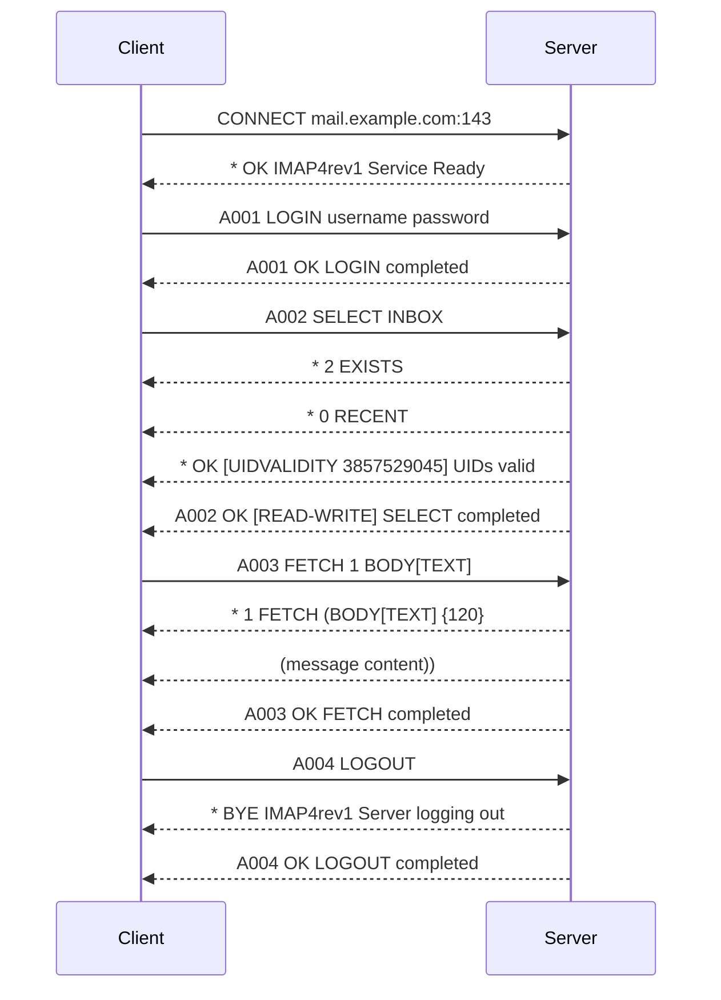

## Internet Message Access Protocol (IMAP)

### Overview

Internet Message Access Protocol (IMAP) is a standard email protocol that allows users to access and manage their emails on a remote mail server. Unlike POP3, IMAP enables users to view and manipulate their emails directly on the server, providing better support for accessing emails from multiple devices.

### Key Features

- **Email Synchronization**: IMAP synchronizes emails across multiple devices, ensuring that changes made on one device are reflected on all others.
- **Server-Side Management**: Emails are stored on the server, allowing users to organize, search, and manage their emails without downloading them.
- **Multiple Folders**: IMAP supports multiple folders and subfolders, enabling users to organize their emails efficiently.
- **Partial Fetch**: IMAP allows users to fetch parts of an email (e.g., headers, body) without downloading the entire message.
- **Offline Access**: While IMAP is designed for online access, it also supports offline access by caching emails locally.

### How IMAP Works

1. **Connection Establishment**:
   - The email client connects to the mail server on TCP port 143 (or port 993 for IMAP over SSL/TLS).
   - The client sends a username and password to authenticate the user.

2. **Email Management**:
   - The client issues commands to list, fetch, and manipulate emails on the server.
   - Emails remain on the server, and changes are synchronized across all devices.

3. **Disconnection**:
   - The client can disconnect from the server while keeping emails on the server.
   - Cached emails can be accessed offline.

### IMAP Commands

- **LOGIN**: Authenticates the user with a username and password.
- **SELECT**: Selects a mailbox to access.
- **EXAMINE**: Selects a mailbox in read-only mode.
- **FETCH**: Retrieves specific parts of messages.
- **SEARCH**: Searches for messages that match given criteria.
- **STORE**: Changes message flags.
- **COPY**: Copies messages to another mailbox.
- **LOGOUT**: Ends the session.

### Security Considerations

- **Encryption**: IMAP can be used with SSL/TLS (referred to as IMAPS) to encrypt the connection and protect the transmission of credentials and email content.
- **Authentication**: IMAP supports various authentication methods, including plain text and secure mechanisms.

### Common Use Cases

- **Multi-Device Access**: IMAP is ideal for users who access their email from multiple devices, such as smartphones, tablets, and computers.
- **Server-Side Management**: Users who prefer to manage their emails on the server, including organizing them into folders and searching through them, benefit from IMAP.
- **Email Synchronization**: IMAP ensures that emails and their statuses (read, unread, flagged) are synchronized across all devices.

### Example IMAP Session

```plaintext
Client:   CONNECT mail.example.com:143
Server:   * OK IMAP4rev1 Service Ready
Client:   A001 LOGIN username password
Server:   A001 OK LOGIN completed
Client:   A002 SELECT INBOX
Server:   * 2 EXISTS
           * 0 RECENT
           * OK [UIDVALIDITY 3857529045] UIDs valid
           A002 OK [READ-WRITE] SELECT completed
Client:   A003 FETCH 1 BODY[TEXT]
Server:   * 1 FETCH (BODY[TEXT] {120}
           (message content))
           A003 OK FETCH completed
Client:   A004 LOGOUT
Server:   * BYE IMAP4rev1 Server logging out
           A004 OK LOGOUT completed
```

### Sequence Diagram



This diagram and example illustrate the typical sequence of commands and responses in an IMAP session, from connecting to the server to logging in, selecting a mailbox, fetching a message, and finally logging out.