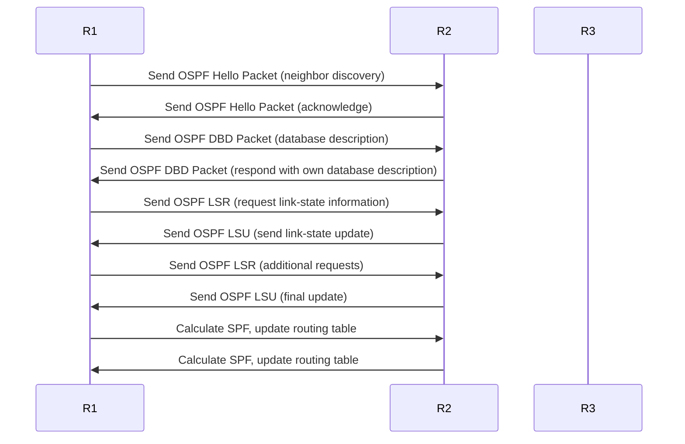

## **Open Shortest Path First (OSPF)**

#### **Overview of OSPF**

**Definition**:  
OSPF (Open Shortest Path First) is a link-state routing protocol used in IP networks. Unlike RIP, which is a distance-vector protocol, OSPF uses the **Shortest Path First** (SPF) algorithm to find the best path by considering various metrics like bandwidth and delay. It is widely used in enterprise networks due to its scalability and efficiency.

#### **Key Features of OSPF**

- **Link-State Protocol**: OSPF operates as a link-state protocol where each router maintains a map (LSDB - Link-State Database) of the entire network topology, allowing routers to calculate the best path to each destination.
- **Hierarchical Design**: OSPF supports hierarchical routing through the concept of areas, which helps in reducing the routing overhead and increasing scalability. OSPF networks are typically divided into multiple areas with one central area (Area 0) known as the **backbone area**.
- **Metric**: OSPF uses **cost** as its metric, where the cost is determined based on bandwidth. The lower the cost, the preferred the route. The cost can also be manually configured by the network administrator.
- **Faster Convergence**: OSPF has much faster convergence compared to RIP due to its efficient algorithm and fast detection of topology changes.
- **Classless Routing**: OSPF supports Classless Inter-Domain Routing (CIDR) and uses subnet masks to support variable-length subnet masks (VLSM).

#### **OSPF Message Types**

OSPF routers communicate using **OSPF packets**. There are five types of OSPF messages:

1. **Hello Packet**: Used to discover and maintain OSPF neighbors.
2. **Database Description (DBD) Packet**: Used to exchange summaries of the OSPF link-state database.
3. **Link-State Request (LSR) Packet**: Used to request more specific information from a neighbor.
4. **Link-State Update (LSU) Packet**: Used to send link-state advertisements (LSAs) that contain routing information.
5. **Link-State Acknowledgment (LSAck) Packet**: Used to acknowledge the receipt of LSAs.

#### **OSPF Router Types**

OSPF defines several router types to distinguish between different network roles:

1. **Internal Router**: A router within a single OSPF area.
2. **Backbone Router**: A router within Area 0 (the backbone area) of an OSPF network.
3. **Area Border Router (ABR)**: A router connecting two or more OSPF areas.
4. **Autonomous System Boundary Router (ASBR)**: A router that connects an OSPF network to an external routing domain (e.g., the internet).

#### **OSPF Areas**

OSPF networks are divided into **areas** to reduce routing overhead:

- **Area 0 (Backbone Area)**: The backbone area connects all other areas. Every OSPF network must have a backbone area.
- **Regular Areas**: These are any areas that connect to Area 0 and hold a subset of the OSPF network.
- **Stub Area**: An area that does not receive external routes.
- **Totally Stubby Area**: A stricter version of the stub area that does not receive external or summary routes.
- **NSSA (Not So Stubby Area)**: An area that can accept external routes but with restrictions.

#### **OSPF Route Types**

OSPF uses several types of routes, each with different characteristics:

1. **Intra-Area Routes**: Routes that exist within the same OSPF area.
2. **Inter-Area Routes**: Routes between different OSPF areas.
3. **External Routes**: Routes originating outside the OSPF Autonomous System (e.g., from the internet).

#### **OSPF Convergence Process**

OSPF converges by exchanging link-state information:

1. **Neighbor Discovery**: OSPF routers use Hello packets to discover and maintain neighbors.
2. **Database Exchange**: Routers exchange Database Description (DBD) packets to compare their link-state databases.
3. **Link-State Request/Update**: If one router’s link-state database is outdated or missing information, it sends a Link-State Request (LSR) for the required information, which is then sent back using Link-State Update (LSU) packets.
4. **SPF Calculation**: Once all routers have the complete link-state information, they calculate the shortest path tree using the Dijkstra SPF algorithm.
5. **Routing Table Update**: The routers update their routing tables based on the SPF algorithm and the calculated paths.

#### **OSPF Example**

Consider a network with three routers (R1, R2, and R3) connected in a triangle.

- **Router R1** is directly connected to **R2** and **R3**.
- **Router R2** is directly connected to **R3**.
- OSPF will ensure that each router has an identical map of the network, and each router will calculate the shortest path to every destination based on OSPF's cost metric.

#### **Advantages of OSPF**

- **Scalability**: OSPF is highly scalable and can efficiently handle large and complex networks with many routers.
- **Faster Convergence**: OSPF provides faster convergence than RIP, making it more suitable for dynamic and large-scale networks.
- **Classless Routing**: OSPF supports CIDR and VLSM, providing flexibility in IP address assignments and network design.
- **Hierarchical Design**: With areas and the backbone area, OSPF can optimize routing and reduce overhead.

#### **Limitations of OSPF**

- **Complexity**: OSPF is more complex to configure and maintain than RIP due to its larger feature set.
- **Memory and CPU Usage**: OSPF requires more resources (memory, CPU) than simpler protocols like RIP, which may be a concern in some environments.
- **Overhead**: The exchange of LSAs and maintaining the link-state database can add some network overhead.

#### **Use Cases**

1. **Enterprise Networks**: OSPF is often used in large enterprise networks where scalability and efficient routing are important.
2. **Service Provider Networks**: OSPF can be used by ISPs for managing internal routing in large, distributed networks.
3. **Data Centers**: OSPF is used in data centers for managing routing between different network segments and devices.

#### **Diagram of OSPF Communication**

#### **Conclusion**

OSPF is a powerful and scalable link-state routing protocol designed for larger and more dynamic networks. It is more efficient and faster in convergence compared to older protocols like RIP, and it provides a hierarchical network design using areas. However, its complexity and higher resource consumption make it more suitable for medium to large enterprise and service provider networks.