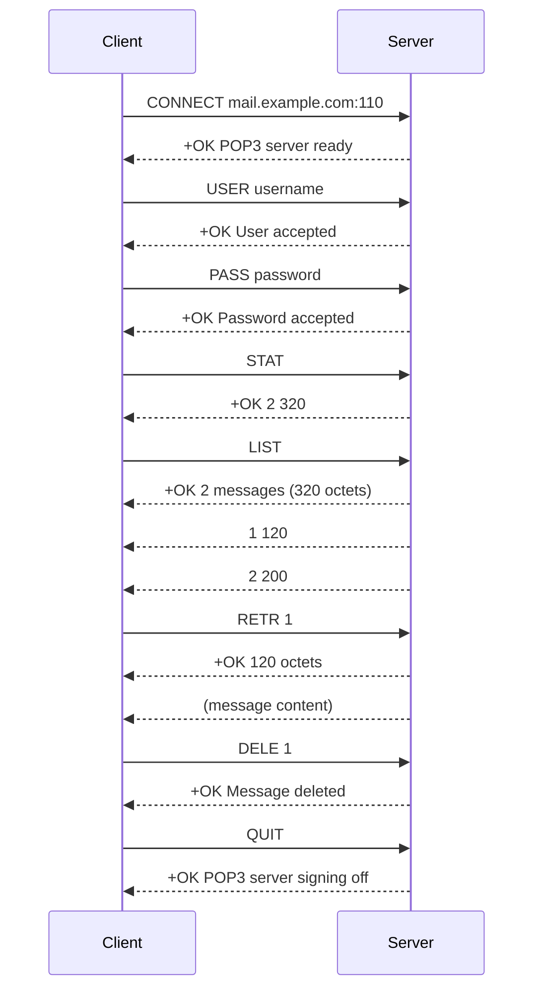

## Post Office Protocol 3 (POP3)

### Overview

Post Office Protocol version 3 (POP3) is a standard mail protocol used to retrieve emails from a remote server to a local client. POP3 allows users to download their emails from the server to their local computer and read them offline. It is a simple, standardized protocol that is widely supported by email clients and servers.

### Key Features

- **Email Retrieval**: POP3 is designed primarily for retrieving emails from a mail server to a local client.
- **Offline Access**: Once emails are downloaded, they can be accessed offline without an internet connection.
- **Simple Protocol**: POP3 is a straightforward protocol with a limited set of commands, making it easy to implement and use.
- **Single Device Access**: POP3 is best suited for users who access their email from a single device, as it does not synchronize emails across multiple devices.

### How POP3 Works

1. **Connection Establishment**:
   - The email client connects to the mail server on TCP port 110 (or port 995 for POP3 over SSL/TLS).
   - The client sends a username and password to authenticate the user.

2. **Email Retrieval**:
   - The client issues commands to retrieve emails from the server.
   - Emails are downloaded to the local client and typically deleted from the server (though some clients offer an option to leave a copy on the server).

3. **Disconnection**:
   - Once emails are downloaded, the client disconnects from the server.
   - The downloaded emails are stored locally and can be accessed offline.

### POP3 Commands

- **USER**: Specifies the username for authentication.
- **PASS**: Specifies the password for authentication.
- **STAT**: Requests the status of the mailbox (number of messages and total size).
- **LIST**: Lists the messages and their sizes.
- **RETR**: Retrieves a specific message by its number.
- **DELE**: Marks a specific message for deletion.
- **NOOP**: No operation, used to keep the connection alive.
- **QUIT**: Ends the session and optionally deletes marked messages.

### Security Considerations

- **Encryption**: POP3 can be used with SSL/TLS (referred to as POP3S) to encrypt the connection and protect the transmission of credentials and email content.
- **Authentication**: POP3 supports basic authentication methods, but it is recommended to use encrypted connections to prevent credentials from being transmitted in plain text.

### Common Use Cases

- **Personal Email Access**: POP3 is commonly used by individuals to download and manage their personal emails on a single device.
- **Offline Email Access**: Users who need to access their emails without an internet connection can benefit from POP3's offline capabilities.
- **Simple Email Retrieval**: POP3 is suitable for users who prefer a simple and straightforward method of retrieving their emails.

### Example POP3 Session

```plaintext
Client:   CONNECT mail.example.com:110
Server:   +OK POP3 server ready
Client:   USER username
Server:   +OK User accepted
Client:   PASS password
Server:   +OK Password accepted
Client:   STAT
Server:   +OK 2 320
Client:   LIST
Server:   +OK 2 messages (320 octets)
           1 120
           2 200
Client:   RETR 1
Server:   +OK 120 octets
           (message content)
Client:   DELE 1
Server:   +OK Message deleted
Client:   QUIT
Server:   +OK POP3 server signing off
```

### POP3 Serquence Diagram


### Conclusion

POP3 is a widely used email retrieval protocol that allows users to download their emails from a remote server to a local client. It is simple, easy to implement, and provides offline access to emails. However, it is best suited for users who access their email from a single device, as it does not support synchronization across multiple devices. For enhanced security, it is recommended to use POP3 with SSL/TLS encryption.