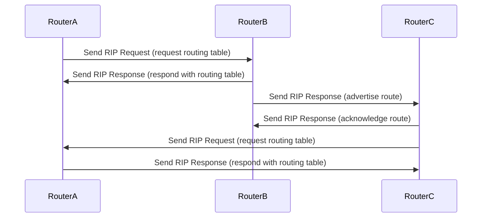

## **Routing Information Protocol (RIP)**

#### **Overview of RIP**

**Definition**:  
The Routing Information Protocol (RIP) is one of the oldest distance-vector routing protocols used to manage routing decisions in IP networks. It uses the number of hops as a metric to determine the best route. RIP is typically used in smaller networks due to its simplicity.

#### **Key Features of RIP**

- **Distance-Vector Protocol**: RIP is based on the distance-vector algorithm, where each router shares its routing table with neighbors periodically.
- **Hop Count as Metric**: The metric used by RIP is the hop count, which is the number of routers a packet must pass through to reach the destination. The maximum hop count allowed by RIP is 15, making it unsuitable for large-scale networks.
- **Periodic Updates**: RIP routers exchange their routing tables with neighbors every 30 seconds. This helps keep the routing tables up to date.
- **Simple Configuration**: RIP is easy to configure and maintain, making it suitable for smaller, less complex networks.

#### **RIP Versions**

1. **RIP v1**:
   - **Classful Routing**: RIP v1 does not support subnet masks, so it assumes all networks are classful (Class A, B, C).
   - **Broadcasting**: RIP v1 sends updates using broadcasting, which may lead to network inefficiencies.

2. **RIP v2**:
   - **Classless Routing**: RIP v2 supports subnetting and uses classless routing, allowing for flexible subnet masks.
   - **Multicast**: RIP v2 uses multicast (224.0.0.9) for sending routing updates, reducing unnecessary broadcast traffic.
   - **Authentication**: RIP v2 supports simple password-based authentication for security.

3. **RIPng (RIP next generation)**:
   - **IPv6 Support**: RIPng is an extension of RIP v2 that supports IPv6 addresses and is used in IPv6 networks.

#### **RIP Message Format**

RIP messages are exchanged in **RIP Datagram** format and include the following:
- **Command**: Indicates whether the message is a request (0) or response (1).
- **Version**: Indicates the RIP version (1, 2, or 3).
- **Address Family Identifier (AFI)**: Indicates the protocol used (IPv4 or IPv6).
- **Routing Information**: Contains entries for destination IP address, subnet mask, hop count, etc.

#### **RIP Routing Process**

1. **Initial Exchange**:
   - When RIP routers start, they send a **RIP Request** message to all neighbors asking for the routing table.
   - Neighbors respond with a **RIP Response** message containing their routing tables.

2. **Periodic Updates**:
   - RIP routers exchange their routing tables every 30 seconds using **RIP Response** messages. Each router updates its routing table based on the information received.

3. **Route Calculation**:
   - RIP routers calculate the best path to each destination based on the hop count metric. The path with the fewest hops is chosen as the best path.

4. **Convergence**:
   - RIP has slow convergence times, which means it can take some time to adapt to changes in the network, such as link failures or topology changes.

#### **RIP Timer Functions**

- **Update Timer**: RIP routers send updates every 30 seconds to ensure the routing tables are current.
- **Invalid Timer**: If a route becomes invalid (e.g., the destination is unreachable), the router waits for 180 seconds before marking it as unreachable.
- **Hold-down Timer**: Once a route is invalid, RIP uses the hold-down timer to prevent new routes from being accepted until the network stabilizes.
- **Flush Timer**: If a route has been invalid for 240 seconds, it is removed from the routing table.

#### **RIP Example**

- **Scenario**:  
  Consider three routers (R1, R2, and R3) connected in a network, with RIP v2 running.

  - R1 advertises a route to R2 with a hop count of 1.
  - R2 advertises this same route to R3 with a hop count of 2.

- **Routing Table** at R3:
  - Destination: 192.168.1.0, Next Hop: 192.168.2.2, Metric: 2 (R2)
  - R3 uses the route with the lowest metric (i.e., 2) to reach 192.168.1.0.

#### **Advantages of RIP**

- **Simplicity**: RIP is easy to configure and use, making it ideal for small networks.
- **Compatibility**: RIP is widely supported and can work on different vendors' equipment.
- **Classless Support in RIP v2**: RIP v2 allows for more flexible network configurations by supporting classless routing (CIDR).

#### **Limitations of RIP**

- **Limited Scalability**: RIP has a maximum hop count of 15, which makes it unsuitable for larger networks.
- **Slow Convergence**: RIP can take a long time to adapt to network changes, especially in larger networks.
- **Inefficient with Large Networks**: Due to periodic updates and slow convergence, RIP is less efficient for larger, more dynamic networks.

#### **Use Cases**

1. **Small Networks**: RIP is well-suited for small-scale networks with simple topology and minimal security requirements.
2. **Legacy Networks**: Older networks that still use RIP may require maintenance and troubleshooting.
3. **Learning and Education**: RIP is often used in network courses to help students understand routing fundamentals.

#### **Diagram of RIP Communication**

#### **Conclusion**

RIP is a simple and easy-to-use routing protocol ideal for small networks. It operates using hop counts as the metric and supports periodic routing table exchanges. However, due to its limitations in scalability and slow convergence, RIP is generally considered obsolete for large and complex networks, with protocols like OSPF and EIGRP being preferred for modern enterprise networks.

