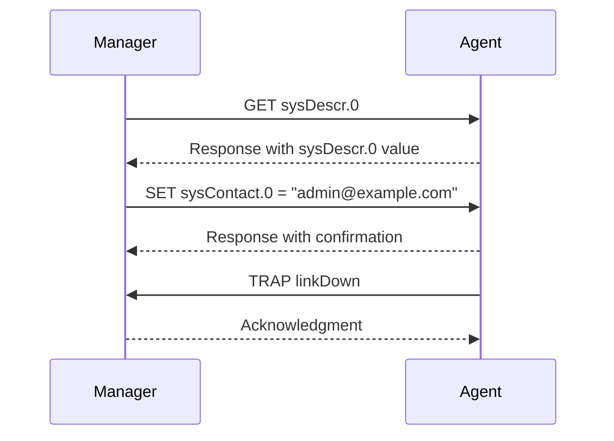

## Simple Network Management Protocol (SNMP)

### Overview

Simple Network Management Protocol (SNMP) is a protocol used for network management, enabling network administrators to manage network performance, find and solve network problems, and plan for network growth. SNMP operates in the application layer of the Internet Protocol Suite.

### Key Features

- **Network Management**: SNMP allows for the monitoring and management of network devices such as routers, switches, servers, printers, and more.
- **Scalability**: SNMP can manage networks of various sizes, from small local networks to large enterprise networks.
- **Extensibility**: SNMP supports a wide range of devices and can be extended with custom Management Information Bases (MIBs).

### How SNMP Works

1. **SNMP Manager**: The SNMP manager is a system that controls and monitors the activities of network devices using SNMP.
2. **SNMP Agent**: The SNMP agent is a software component within the network device that maintains the data for the device and reports these data, as needed, to the SNMP manager.
3. **MIB (Management Information Base)**: The MIB is a collection of information organized hierarchically. These are accessed using a network management protocol such as SNMP.

### SNMP Operations

- **GET**: Retrieves the value of a specific variable.
- **GET-NEXT**: Retrieves the value of the next variable in the MIB hierarchy.
- **SET**: Sets the value of a specific variable.
- **TRAP**: Asynchronously reports an event to the SNMP manager.

### Security Considerations

- **Community Strings**: SNMP uses community strings for authentication. SNMPv1 and SNMPv2 use plain text community strings, while SNMPv3 provides more secure authentication and encryption.
- **Access Control**: SNMPv3 supports access control to restrict which users can access or modify certain MIB objects.

### Example SNMP Session

1. **SNMP Manager**: Sends a GET request to the SNMP agent to retrieve the value of a specific variable.
2. **SNMP Agent**: Responds with the requested value.
3. **SNMP Manager**: Sends a SET request to the SNMP agent to change the value of a specific variable.
4. **SNMP Agent**: Responds with a confirmation of the change.
5. **SNMP Agent**: Sends a TRAP to the SNMP manager to report an event.

### Sequence Diagram



### Example SNMP Commands in Terminal

#### Using `snmpget` to Retrieve a Value

```sh
snmpget -v2c -c public localhost sysDescr.0
```

#### Using `snmpset` to Set a Value

```sh
snmpset -v2c -c private localhost sysContact.0 s "admin@example.com"
```

#### Using `snmptrap` to Send a Trap

```sh
snmptrap -v2c -c public localhost '' linkDown ifIndex.1 i 1
```

### Detailed Example SNMP Session

1. **Retrieve System Description**:
   - **Command**: `snmpget -v2c -c public localhost sysDescr.0`
   - **Response**: `SNMPv2-MIB::sysDescr.0 = STRING: "Linux localhost 4.15.0-20-generic #21-Ubuntu SMP Mon Apr 23 16:44:24 UTC 2018 x86_64"`

2. **Set System Contact**:
   - **Command**: `snmpset -v2c -c private localhost sysContact.0 s "admin@example.com"`
   - **Response**: `SNMPv2-MIB::sysContact.0 = STRING: "admin@example.com"`

3. **Send a Trap**:
   - **Command**: `snmptrap -v2c -c public localhost '' linkDown ifIndex.1 i 1`
   - **Response**: (No direct response, but the trap is sent to the SNMP manager)

This example demonstrates how to use SNMP commands in the terminal to retrieve and set values on a network device, as well as how to send a trap to report an event. The sequence diagram illustrates the typical interactions between an SNMP manager and an SNMP agent.