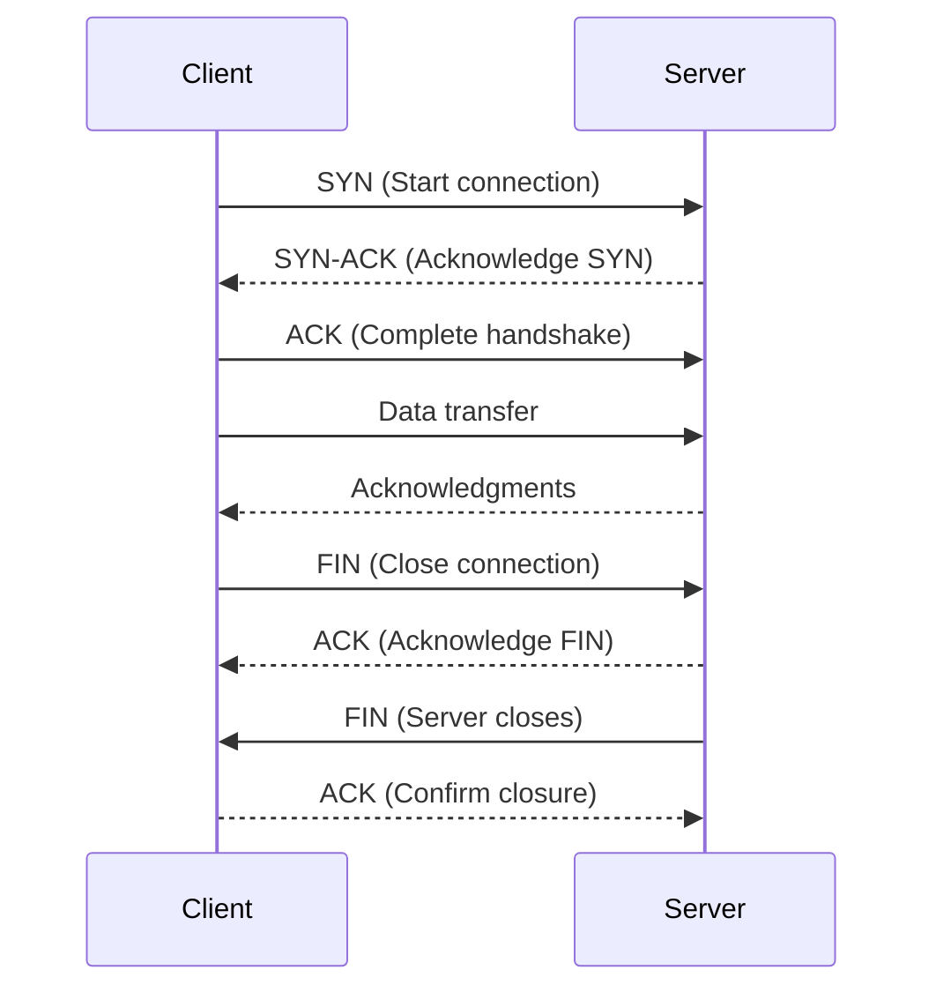

## **Transmission Control Protocol (TCP)**

#### **Overview of TCP**

**Definition**:  
The Transmission Control Protocol (TCP) is a connection-oriented communication protocol in the Internet Protocol (IP) suite. It ensures reliable, ordered, and error-free delivery of data between devices over a network. TCP is used extensively in most internet-based communication, such as web browsing, email, and file transfers.

#### **Key Features of TCP**

- **Connection-Oriented**: TCP establishes a connection between the sender and receiver before data transmission begins. It ensures that the communication channel is open and reliable.
  
- **Reliable Delivery**: It guarantees that data will be delivered correctly and in the correct order. If packets are lost, they are retransmitted.
  
- **Flow Control**: TCP manages the rate of data transmission between devices to prevent congestion and packet loss.
  
- **Error Detection**: It uses checksums to detect errors in transmitted data and requests retransmission of corrupt packets.
  
- **Acknowledgment**: The receiver sends an acknowledgment (ACK) for received packets, confirming successful delivery.
  
- **Sequencing**: TCP assigns sequence numbers to each byte transmitted to maintain the correct order of data, even if packets arrive out of sequence.

#### **How TCP Works**

The transmission of data via TCP involves several steps, including connection establishment, data transfer, and connection termination. These steps are described below:

##### **1. Connection Establishment (Three-Way Handshake)**

Before data transmission begins, TCP uses a three-way handshake to establish a connection between the client and server. This process ensures that both sides are ready for communication.

1. **SYN (Synchronize)**:  
   The client sends a synchronization (SYN) packet to the server, requesting to establish a connection.
   
2. **SYN-ACK (Synchronize-Acknowledge)**:  
   The server responds with a SYN-ACK packet to acknowledge the client's request and establish a connection.
   
3. **ACK (Acknowledge)**:  
   The client sends an acknowledgment (ACK) packet to confirm the establishment of the connection.

After this handshake, data transfer can begin.

##### **2. Data Transmission**

Once the connection is established, TCP allows data to be transmitted in the form of packets. Each packet contains a sequence number, which ensures that the data is received in the correct order.

- **Segmentation**: Large chunks of data are broken down into smaller packets to fit into the transmission window.
- **Flow Control**: The receiver informs the sender of the buffer size, and the sender adjusts the transmission rate accordingly.
- **Error Checking**: Each packet includes a checksum that allows the receiver to detect transmission errors.
- **Acknowledgment**: The receiver sends back an acknowledgment (ACK) for every successfully received packet.

##### **3. Connection Termination (Four-Way Handshake)**

When the data transfer is complete, the connection is terminated using a four-way handshake:

1. **FIN (Finish)**:  
   The sender sends a FIN packet to indicate it has finished sending data.
   
2. **ACK (Acknowledge)**:  
   The receiver acknowledges the FIN packet by sending an ACK.
   
3. **FIN**:  
   The receiver sends a FIN packet to indicate it is also done sending data.
   
4. **ACK**:  
   The sender acknowledges the receiver's FIN packet, completing the termination.

#### **TCP Header Structure**

A TCP packet (also known as a segment) consists of several fields in the header, including:

- **Source Port**: The port number of the sender.
- **Destination Port**: The port number of the receiver.
- **Sequence Number**: The byte number of the first byte in the data segment.
- **Acknowledgment Number**: The sequence number of the next expected byte.
- **Data Offset**: Indicates the size of the TCP header.
- **Flags**: Controls for various aspects of the connection (e.g., SYN, ACK, FIN).
- **Window Size**: Indicates the size of the receiver’s buffer (used for flow control).
- **Checksum**: Used for error-checking of the header and data.
- **Urgent Pointer**: If the URG flag is set, this field indicates the end of urgent data.
- **Options**: Additional options like maximum segment size, timestamp, etc.

#### **TCP Flow Control and Congestion Control**

**Flow Control**:  
TCP flow control ensures that the sender does not overwhelm the receiver. This is achieved through the use of a sliding window mechanism:

- **Receiver Window Size**: The receiver advertises a window size to inform the sender of how much data it can accept at once.
- **Sliding Window**: The sender can send data up to the size of the window and waits for acknowledgment before sending more data.

**Congestion Control**:  
TCP employs various algorithms to control congestion in the network and avoid overloading the network. The key algorithms include:

- **Slow Start**: Starts transmission with a small window size and gradually increases it as the network becomes more stable.
- **Congestion Avoidance**: Once the congestion window grows large enough, the sender moves to congestion avoidance, reducing the rate of increase.
- **Fast Retransmit**: If a packet is lost, it is retransmitted without waiting for the timeout period.
- **Fast Recovery**: When packet loss is detected, the sender reduces its window size and resumes transmission.

#### **TCP vs UDP Comparison**

| **Feature**              | **TCP**                                 | **UDP**                              |
|--------------------------|-----------------------------------------|--------------------------------------|
| **Protocol Type**         | Connection-Oriented                     | Connectionless                      |
| **Reliability**           | Reliable, ensures delivery and order    | Unreliable, no delivery guarantees   |
| **Flow Control**          | Yes, uses sliding window                | No                                   |
| **Error Checking**        | Yes, checksum and retransmission        | Yes, but no retransmission          |
| **Speed**                 | Slower, due to error checking and flow control | Faster, no connection setup and less overhead |
| **Use Cases**             | Web browsing, email, file transfers     | Video streaming, DNS queries, gaming |

#### **TCP Example: Handshake and Data Transfer**

**Three-Way Handshake:**

1. **Client → Server**: SYN (Request to establish connection)
2. **Server → Client**: SYN-ACK (Acknowledgment and acceptance)
3. **Client → Server**: ACK (Confirmation and ready to start data transfer)

**Data Transfer:**

1. Client sends data in packets, and each packet is acknowledged by the server.
2. The receiver sends an ACK after each packet to ensure it has been received.

**Connection Termination:**

1. **Client → Server**: FIN (Finish data transfer)
2. **Server → Client**: ACK (Acknowledgment)
3. **Server → Client**: FIN (Server finishes)
4. **Client → Server**: ACK (Confirmation of termination)

#### **Diagram of TCP Connection**

#### **Advantages of TCP**

- **Reliable Data Transfer**: Guarantees the delivery of data in the correct order, with retransmission for lost packets.
- **Flow Control**: Ensures the receiver is not overwhelmed by too much data at once.
- **Congestion Control**: Prevents network congestion by adjusting the transmission rate based on network conditions.
- **Widely Used**: Supports most critical applications, such as web browsing, email, and file sharing.

#### **Limitations of TCP**

- **Overhead**: The error-checking, acknowledgment, and flow control mechanisms introduce overhead that can slow down communication.
- **Slower Speed**: Due to connection setup, flow control, and retransmissions, TCP is generally slower than connectionless protocols like UDP.
- **Complexity**: The protocol is more complex to implement and manage compared to simpler protocols.

#### **Use Cases for TCP**

- **Web Browsing (HTTP/HTTPS)**: TCP is used to establish reliable connections for loading web pages.
- **Email (SMTP, IMAP, POP3)**: Ensures that emails are sent and received reliably.
- **File Transfer (FTP, SFTP)**: Guarantees that files are transferred completely and correctly.
- **Remote Connections (SSH, Telnet)**: Provides secure and reliable connections for remote management of systems.

### **Conclusion**

TCP is a reliable, connection-oriented protocol that ensures data is transferred accurately and in order between systems. Its extensive use in critical applications demonstrates its importance, but its overhead and relatively slower speeds compared to UDP make it more suitable for applications that require reliability over raw speed.