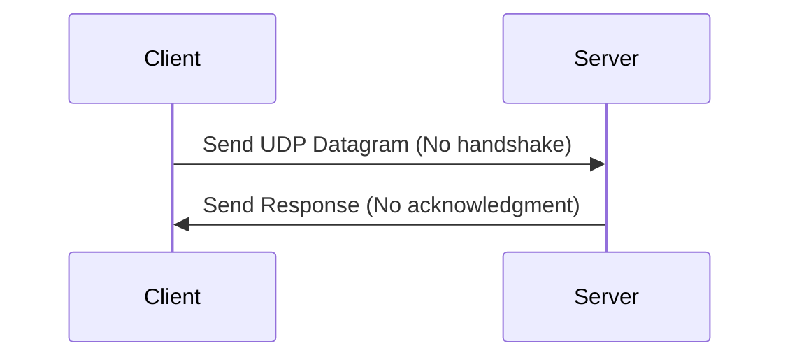

### **User Datagram Protocol (UDP)**

#### **Overview of UDP**

**Definition**:  
The User Datagram Protocol (UDP) is a connectionless protocol used for sending data packets between devices over a network. Unlike TCP, UDP does not establish a connection before sending data, making it faster but less reliable.

#### **Key Features of UDP**

- **Connectionless**: UDP does not establish a connection before data transmission. This reduces the overhead of establishing and maintaining a connection, making UDP faster than TCP.
  
- **Unreliable**: UDP does not guarantee the delivery of packets, nor does it ensure they are received in the correct order. If a packet is lost, it is not retransmitted.

- **No Flow Control**: UDP does not manage the rate at which data is sent, meaning there’s no flow control to prevent overloading the receiver.

- **Low Overhead**: Since it lacks features like connection setup, acknowledgment, and flow control, UDP has lower overhead compared to TCP.

- **Faster**: UDP is typically faster than TCP, as it sends data with minimal delay, without waiting for acknowledgments or retransmissions.

#### **How UDP Works**

UDP simply sends data packets called **datagrams** from the source to the destination. Each datagram consists of a header and the data payload.

1. **No Handshake**: UDP sends data packets without requiring a connection setup (no three-way handshake). 
2. **Datagram**: A UDP datagram consists of a header and payload. The header contains source and destination ports, length, and checksum, while the payload contains the actual data.
3. **Best Effort Delivery**: UDP makes no attempt to retransmit lost packets. It is up to the application to handle lost data if necessary.
4. **No Acknowledgment**: The sender does not wait for an acknowledgment from the receiver. Thus, no guarantee is provided that the receiver will get the data.

#### **UDP Header Structure**

A typical UDP packet consists of a header and data. The header contains the following fields:

- **Source Port**: The port from which the message is sent.
- **Destination Port**: The port to which the message is sent.
- **Length**: The length of the UDP header and data (in bytes).
- **Checksum**: A checksum for error-checking the header and data.

#### **UDP vs TCP Comparison**

| **Feature**              | **UDP**                                 | **TCP**                              |
|--------------------------|-----------------------------------------|--------------------------------------|
| **Protocol Type**         | Connectionless                          | Connection-Oriented                   |
| **Reliability**           | Unreliable                              | Reliable, ensures delivery and order |
| **Flow Control**          | No                                      | Yes, uses sliding window             |
| **Error Checking**        | Yes, but no retransmission             | Yes, with retransmission and acknowledgments |
| **Speed**                 | Faster, lower overhead                 | Slower, more overhead due to error checking |
| **Use Cases**             | Video streaming, DNS, online gaming    | Web browsing, email, file transfers  |

#### **UDP Use Cases**

- **Real-Time Applications**: UDP is used in applications where real-time data transfer is critical, such as video streaming, VoIP, and online gaming.
  
- **DNS (Domain Name System)**: DNS relies on UDP to resolve domain names to IP addresses because it requires fast query and response times, and a small packet size.
  
- **Broadcasting**: UDP is useful in broadcasting data to multiple recipients. Since there is no need for a connection setup, it’s efficient for this purpose.

- **Simple Request-Response Protocols**: Many simple protocols, like DHCP (Dynamic Host Configuration Protocol) and SNMP (Simple Network Management Protocol), use UDP.

#### **UDP Example**

A basic UDP communication example between a client and server:

1. **Client → Server**: Sends a datagram to request data or service.
2. **Server → Client**: Sends back a response without acknowledgment.

Since UDP is connectionless, the client sends the datagram without waiting for any handshake, and the server sends the response without any acknowledgment. If packets are lost or corrupted, no action is taken unless the application itself handles it.

#### **Diagram of UDP Communication**

#### **Advantages of UDP**

- **Speed**: UDP’s connectionless nature and lack of overhead make it faster than TCP.
- **Low Latency**: The absence of handshakes, acknowledgments, and flow control reduces latency, making UDP ideal for time-sensitive applications.
- **Reduced Overhead**: UDP’s smaller packet size (due to the lack of connection setup and flow control) means less bandwidth consumption.

#### **Limitations of UDP**

- **Unreliable**: UDP does not guarantee the delivery of data. Some packets may be lost or arrive out of order.
- **No Flow Control**: It does not manage the speed of data transmission, potentially leading to congestion.
- **No Congestion Control**: UDP does not adjust transmission based on network conditions, which may cause network congestion or packet loss.

#### **Conclusion**

UDP is an efficient, low-latency protocol ideal for real-time communication, such as video streaming, VoIP, and gaming. However, its lack of reliability and error recovery mechanisms make it unsuitable for applications that require guaranteed delivery, like file transfer or web browsing. For applications where speed is critical and minor data loss is acceptable, UDP is the preferred protocol.

